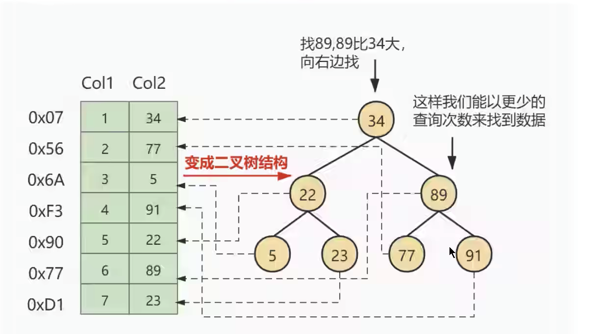
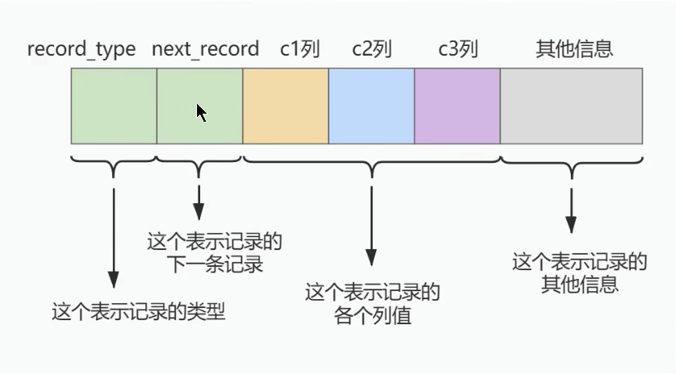
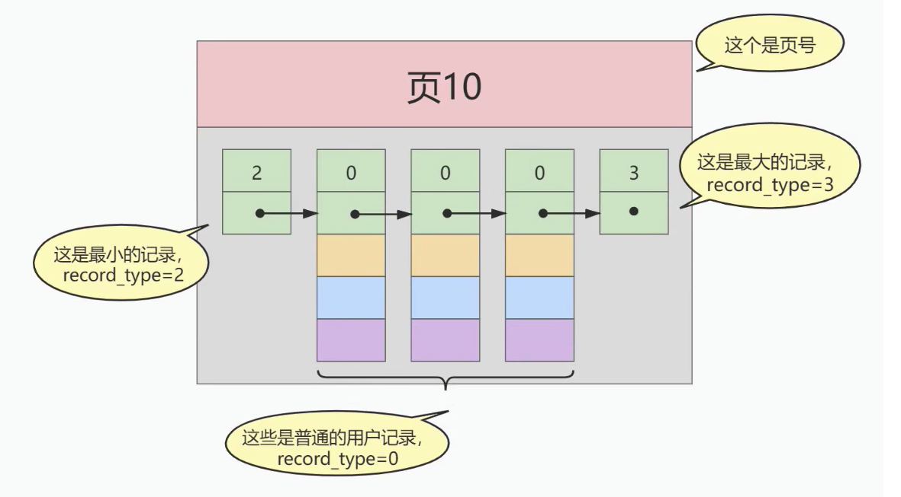
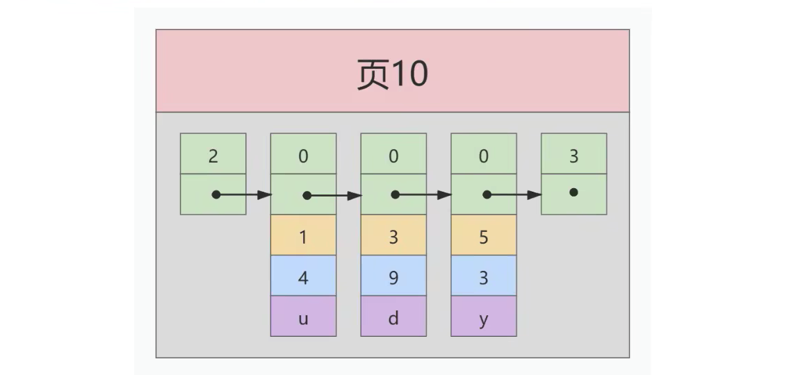
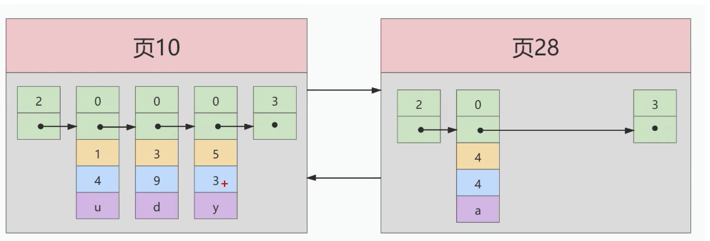
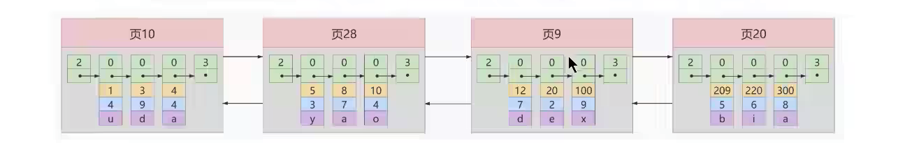
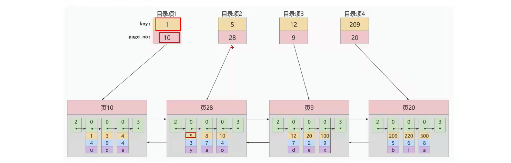
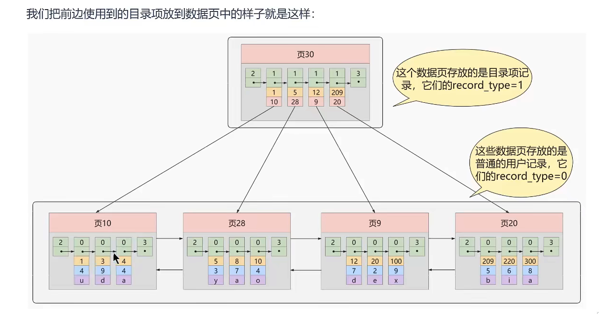
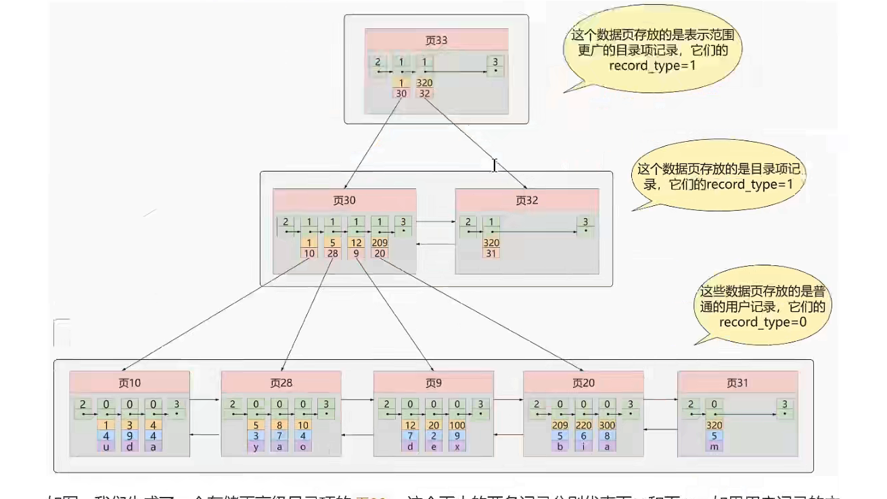
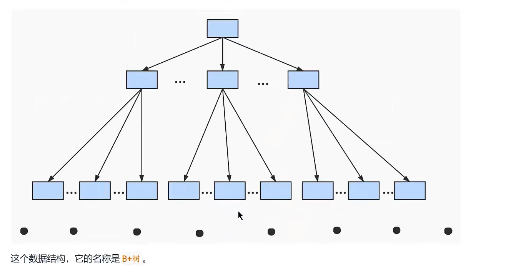

## 索引的数据结构

### 1、为什么使用索引

`概念:` 索引是存储索引用于快速找到数据记录的一种数据结构，就好比一本书的目录部分，通过目录中中啊抖啊对应的文章的页码，便可以快速定位到需要的文章，Mysql 中也是一样的道理，进行数据查找时首先查看查询条件是否命中某条索引，符合则通过索引查找相关数据，如果不符合则需要全表扫描，即需要一条条差咋后记录，知道找到与条件符合的记录。


如果当数据没有`任何索引`的情况下，数据会分布在磁盘上不同的位置上面，当读取数据时，磁盘摆臂需要前后摆动查找数据，这样的操作非常消耗时间。如果`数据顺序摆放`,那么也需要数次IO操作，依旧非常耗时，如果不借助任何索引结构帮助我们快速定位数据，那么当我们查询时需要逐行扫描、比较。当有上千万数据时，就意味着需要做更多的磁盘IO才能找到对应的数据。

当我们需要`查找一条数据`时（如：Col2=89）：
		CPU需要先去磁盘查找这条记录，找到之后加载到内存，在对数据进行处理。这个过程最消耗时间的就是磁盘I/O（涉及到磁盘的旋转时间[速度较快]、磁头的寻道时间【速度慢、费时】）

​	假如给数据使用`二叉树（又叫搜索二叉树、二叉搜索树）`这样的数据结构进行存储，如图：

​	

​	对col2 添加了索引，就相当于在硬盘上为col2维护了一个索引的数据结构，即二叉树，二叉搜索树的每个节点存储的是`k，v结构`，key是col2，value是key所在的文件指针，那么对col2添加了索引，这时再去查找col2=89这条记录时，先查询`二叉搜索树（二叉遍历查询）`。读34到内存中，进行对比 89 > 34,继续右侧查询 读89到内存。比对之后返回指针数据。在根据当前的value快速定位到对应的数据地址，此时我们发现，只需要两次I/O就可以定位到记录，查询的速度就提高了。

这就是我们为什么要建索引，建索引的目的就是为了减少磁盘I/O，加快查询效率。

### 2、索引及其优缺点

####   2.1索引概述

​	Mysql官方对索引的定义为：`索引（index）是帮助mysql高效获取数据的数据结构`。

​	`索引的本质` 是数据结构，可以简单的理解为‘排好序的快速查找数据结构’，满足特定的查找算法。这些数据结构以某种方式指向数据，这样就可以在这些数据结构的基础上实现`高级查询算法`。

​	`索引是在存储引擎中实现的`,因此每种存储引擎的索引不一定完全相同，并且每种存储引擎不一定支持所有的索引类型。同时存储引擎可以定义每个表的`最大索引`和`最大索引长度`,所有的存储引擎支持每个表至少16个索引，总索引长度纸撒后为256字节。有些引擎支持更多的索引数和更大的长度。

####   2.2优点

	1. 降低数据库的IO成本，这也是建立索引最主要的原因。
	1. 可以创建唯一索引，保证数据库中表数据的唯一性。
	1. 在实现数据的参考完整性方面，可以`加速表与表之间的连接`。换句话说，对于子表和父表联合查询时可以提高查询速度。
	1. 在使用分组和排序子句进行查询时，可以`显著的减少查询中分组和排序的时间`,减少CPU消耗

####   2.3缺点

创建索引也有许多不利的方面，主要表现在以下几点

1. 创建和维护索引需要`耗费时间`,随着数据的增加，耗费的时间也随之增加。
2. 创建索引需要`占用磁盘空间`, 除了数据表展数据空间之外，每个索引还要占用一定的物理空间，存储在磁盘上如果有大量的索引，索引文件就可能比数据文件更快达到最大文件尺寸。
3. 虽然索引大大提高了查询速度，同时却也会`降低更新表的速度`，当对表中的数据进行增加、删除、修改的操作，索引也要动态维护，这样就降低了数据的维护速度。

**因此，在选择使用索引时，需要综合考虑使用索引的优缺点。**


**提示：索引可以提高查询速度，但是会影响插入记录的速度，在这种情况下，最好的办法是删除表中索引，然后插入数据，完成后在创建索引。（在频繁的更新索引时，重新建立索引反而会消耗比较少的时间）**


### 3、InnoDB索引的推演

####  3.1 索引之前的查找

一个简单的查询：

```mysql
select 列名列表 from table where 列名 = xxx
```

 1. 在一个页中查找：

    假设目前表中的记录比较少，所有的记录都可以被放在一个页中，在查找记录的时候可以根据搜索条件的不同分为两种情况

    - 以主键为搜索条件：

        在页目录中使用二分法快速定位到对应的槽，然后便利该槽对应分组中的记录即可快速找到制定记录

    - 以其他列作为搜索条件

        因为在数据页中并没有对非主键列建立所谓的页目录，所以`无法通过二分法查找`，这种情况只能`从最小记录开始依次遍历`单链表中的每条记录，然后对比每条记录是不是符合搜索条件，显然，这种查找的方式效率是非常低的。

 2. 在很多页中查找：

    大部分情况下我们表中存放的记录都是非常多的，需要很多的数据页来存储这些记录。在很多页中查找记录的话可以分为两个步骤：

    - 定位到记录所在的页。
    - 从所在的页内中查找相应的记录。

    在没有索引的情况下，不论是根据主键列或者其他列的值进行查找，由于我们`并不能快速的定位到记录所在的页`，所以只能`从第一个页沿着双向链表`一直往下找，在每一个页根据上面的查找方式去查找指定的记录。因为要遍历所有的数据页，所以这种方式显然是`超级耗时`的，如果表有一亿条数据呢，索引应运而生。


**`数据存储的基本单位称之为数据页。`**

**`一个数据页的大小为16kb。`**

####  3.2 设计索引

​	首先建立一个表：

```mysql
CREATE TABLE index_demo(
	c1 int,
	c2 int,
	c3 char,
	PRIMARY KEY(c1)
) ROW_FORMAT = Compact;
```

 index_demo表有两个int类型的列，1个char类型，规定了c1主键，使用Compact行格式来实际存储记录。这里简化了index_demo的行格式示意图：




其中：

- `record_type`:记录头信息的一项属性，表示记录的类型，0表示普通记录，2表示最小记录。3表示最大记录、1暂时没用过，下面讲。
- `next_record`:记录头信息的一项属性,表示下一条记录的地址偏移量，用箭头表示下一条记录是谁。
- `各个列的值`: 这个只记录的三个列，分别是c1、c2、c3.
- `其他信息`:除了上述三种信息以外的所有信息，包括其他隐藏列的值以及记录的额外信息。

把一些记录放到数据页的示意图就是：





##### 1、`一个简单的设计方案`

​	我们在根据某个搜索条件查找一些记录，为什么要便利所有的数据页呢？因为在各个页中的记录并没有规律，我们并不知道我们的搜索条件匹配那些页中的记录，所以不得不依次便利所有的数据页。所以如果我们想要快速定位到需要的记录在那些数据页中该怎么办。我们可以为快速定位记录所在的数据页而建立一个目录，那建立目录时 必须完成下边这些事:

- `下一个数据页中用户记录的主键值必须大于上一个页中用户记录的主键值：`

假设：每个数据页只能存放三个记录(实际非常大，可以存很多)，那么这些记录已经按照主键值的大小串联成一个单向链表了。如图：




​	当我们再次插入一条记录时，因为页10 最多放3条记录，所以不得不再次分配一个新页：





​	新分配的数据页编号可能并不是连续的，他们只是通过维护这上一个页和下一个页的编号而建立了链表关系，另外页10中用户记录最大的主键值是5，而页28中有个记录主键值是4，所以在插入主键值为4的记录时需要伴随着一次`记录移动`，也就是需要把4和5 进行调换。

​	这个过程表名了在对页中的记录进行增删改查时，必须通过一些诸如此类的记录移动的操作来保持这个状态的成立：下一个数据页中的用户记录的主键值必须大于上一个页中用户记录的主键值，这个过程称之为`页分裂`。

- `给所有的页建立一个目录项:`

​    由于数据页的顺序可能是不连续的，所以在向index_demo 中插入数据后，可能是这样的结果：




​    因为这些16kb的页在物理存储上是`不连续的`，所以想要从这些页中根据主键值快速定位记录所在页，需要给他们做个目录。每个页对应一个目录项，每个目录项包括下边两个部分

 	1. 页的用户记录中最小的记录值用key表示
 	2. 页号： 用page_no表示（数据页地址）

​	所以上面几个数据页做好的目录就是这样：

​	




以页28为例，对应目录项2，这个目录的包含着`页号28`(也就是页指针)以及最小主键值5，我们只需要把这个目录项在物理存储器上连续存储（比如：数组），可以实现根据主键值快速查找某条记录的功能了。

比如：查找主键为c1为20的记录，具体分两步

	1. 先从目录项根据`二分法`确定出主键值为20的记录在`目录项三`中，对应的页是页9
	1. 在根据前边说的在页中查找记录的方式去页9中定位具体的记录。


那上面这些个过程就是针对主键为c1的列建立了一个目录项的方案，这个方案就叫做`索引`


##### 2、InnoDB的索引方案

1. 迭代一次：目录项记录的页

2. 迭代两次：多个目录项记录的页

3. 迭代三次：目录项记录页的目录页 

4. B+Tree

   


在第0层（最底层） 中存放这具体数据，数据与数据之间为单向链表，页与页之间为双向链表。


B+Tree树：不论是存放`用户记录的数据`，还是存放`目录项记录`的数据页，我们都把他们放在b+树这个数据结构中，所以我们也这些数据页为`节点`，我们的实际用户记录其实都存放在b+树最底层的节点上，这些节点也称之为`叶子节点`，其余用来存放目录项的节点称之为`非叶子节点或者内节点`，其中B+树最上面的节点称为跟节点。

B+Tree树节点可以分为很多层，规定最下面的那层，也就是存放记录的第0层，之后依次往上加。

假设：所有存放记录的叶子节点能存放100条用户记录，所有存放目录项记录的内节点存放100条目录项，那么：


通常在一般情况下，我们`用到的B+树不会超过4层`. 节点层越高I/O 次数越多


#### 3.3 常见索引概念

索引按照物理实现的方式，索引可以分为2种`聚簇(聚集)索引和非聚簇(非聚集)索引`，我们也把非聚集索引称为`二级索引`或者`辅助索引`。

#####   3.3.1 `聚簇索引`

​	聚簇索引并不是一种单独的索引类型，而是一种`数据存储方式`（所有的用户记录都存储在了叶子节点），也就是所谓的`索引即数据，数据即索引`

> 术语`聚簇`表示数据行与相邻的键值聚簇的存储在一起


