## 索引的数据结构

### 1、为什么使用索引

`概念:` 索引是存储索引用于快速找到数据记录的一种数据结构，就好比一本书的目录部分，通过目录中对应的文章的页码，便可以快速定位到需要的文章，Mysql 中也是一样的道理，进行数据查找时首先查看查询条件是否命中某条索引，符合则通过索引查找相关数据，如果不符合则需要全表扫描，即需要一条条查找后记录，一直到找到与条件符合的记录。


如果当数据没有`任何索引`的情况下，数据会分布在磁盘上不同的位置上面，当读取数据时，磁盘摆臂需要前后摆动查找数据，这样的操作非常消耗时间。如果`数据顺序摆放`,那么也需要数次IO操作，依旧非常耗时，如果不借助任何索引结构帮助我们快速定位数据，那么当我们查询时需要逐行扫描、比较。当有上千万数据时，就意味着需要做更多的磁盘IO才能找到对应的数据。

当我们需要`查找一条数据`时（如：Col2=89）：
		CPU需要先去磁盘查找这条记录，找到之后加载到内存，在对数据进行处理。这个过程最消耗时间的就是磁盘I/O（涉及到磁盘的旋转时间[速度较快]、磁头的寻道时间【速度慢、费时】）

​	假如给数据使用`二叉树（又叫搜索二叉树、二叉搜索树）`这样的数据结构进行存储，如图：

​	

​	对col2 添加了索引，就相当于在硬盘上为col2维护了一个索引的数据结构，即二叉树，二叉搜索树的每个节点存储的是`k，v结构`，key是col2，value是key所在的文件指针，那么对col2添加了索引，这时再去查找col2=89这条记录时，先查询`二叉搜索树（二叉遍历查询）`。读34到内存中，进行对比 89 > 34,继续右侧查询 读89到内存。比对之后返回指针数据。在根据当前的value快速定位到对应的数据地址，此时我们发现，只需要两次I/O就可以定位到记录，查询的速度就提高了。

这就是我们为什么要建索引，建索引的目的就是为了减少磁盘I/O，加快查询效率。

### 2、索引及其优缺点

####   2.1索引概述

​	Mysql官方对索引的定义为：`索引（index）是帮助mysql高效获取数据的数据结构`。

​	`索引的本质` 是数据结构，可以简单的理解为‘排好序的快速查找数据结构’，满足特定的查找算法。这些数据结构以某种方式指向数据，这样就可以在这些数据结构的基础上实现`高级查询算法`。

​	`索引是在存储引擎中实现的`,因此每种存储引擎的索引不一定完全相同，并且每种存储引擎不一定支持所有的索引类型。同时存储引擎可以定义每个表的`最大索引`和`最大索引长度`,所有的存储引擎支持每个表至少16个索引，总索引长度最大为256字节。有些引擎支持更多的索引数和更大的长度。

####   2.2优点

1. 降低数据库的IO成本，这也是建立索引最主要的原因。
1. 可以创建唯一索引，保证数据库中表数据的唯一性。
1. 在实现数据的参考完整性方面，可以`加速表与表之间的连接`。换句话说，对于子表和父表联合查询时可以提高查询速度。
1. 在使用分组和排序子句进行查询时，可以`显著的减少查询中分组和排序的时间`,减少CPU消耗

####   2.3缺点

创建索引也有许多不利的方面，主要表现在以下几点

1. 创建和维护索引需要`耗费时间`,随着数据的增加，耗费的时间也随之增加。
2. 创建索引需要`占用磁盘空间`, 除了数据表占据数据空间之外，每个索引还要占用一定的物理空间，存储在磁盘上如果有大量的索引，索引文件就可能比数据文件更快达到最大文件尺寸。
3. 虽然索引大大提高了查询速度，同时却也会`降低更新表的速度`，当对表中的数据进行增加、删除、修改的操作，索引也要动态维护，这样就降低了数据的维护速度。

**因此，在选择使用索引时，需要综合考虑使用索引的优缺点。**


**提示：索引可以提高查询速度，但是会影响插入记录的速度，在这种情况下，最好的办法是删除表中索引，然后插入数据，完成后在创建索引。（在频繁的更新索引时，重新建立索引反而会消耗比较少的时间）**


### 3、InnoDB索引的推演

####  3.1 索引之前的查找

一个简单的查询：

```mysql
select 列名列表 from table where 列名 = xxx
```

 1. 在一个页中查找：

    假设目前表中的记录比较少，所有的记录都可以被放在一个页中，在查找记录的时候可以根据搜索条件的不同分为两种情况

    - 以主键为搜索条件：

        在页目录中使用二分法快速定位到对应的槽，然后便利该槽对应分组中的记录即可快速找到制定记录

    - 以其他列作为搜索条件

        因为在数据页中并没有对非主键列建立所谓的页目录，所以`无法通过二分法查找`，这种情况只能`从最小记录开始依次遍历`单链表中的每条记录，然后对比每条记录是不是符合搜索条件，显然，这种查找的方式效率是非常低的。

 2. 在很多页中查找：

    大部分情况下我们表中存放的记录都是非常多的，需要很多的数据页来存储这些记录。在很多页中查找记录的话可以分为两个步骤：

    - 定位到记录所在的页。
    - 从所在的页内中查找相应的记录。

    在没有索引的情况下，不论是根据主键列或者其他列的值进行查找，由于我们`并不能快速的定位到记录所在的页`，所以只能`从第一个页沿着双向链表`一直往下找，在每一个页根据上面的查找方式去查找指定的记录。因为要遍历所有的数据页，所以这种方式显然是`超级耗时`的，如果表有一亿条数据呢，索引应运而生。


**`数据存储的基本单位称之为数据页。`**

**`一个数据页的大小为16kb。`**

####  3.2 设计索引

​	首先建立一个表：

```mysql
CREATE TABLE index_demo(
	c1 int,
	c2 int,
	c3 char,
	PRIMARY KEY(c1)
) ROW_FORMAT = Compact;
```

 index_demo表有两个int类型的列，1个char类型，规定了c1主键，使用Compact行格式来实际存储记录。这里简化了index_demo的行格式示意图：


其中：

- `record_type`:记录头信息的一项属性，表示记录的类型，0表示普通记录，2表示最小记录。3表示最大记录、1暂时没用过，下面讲。
- `next_record`:记录头信息的一项属性,表示下一条记录的地址偏移量，用箭头表示下一条记录是谁。
- `各个列的值`: 这个只记录的三个列，分别是c1、c2、c3.
- `其他信息`:除了上述三种信息以外的所有信息，包括其他隐藏列的值以及记录的额外信息。

把一些记录放到数据页的示意图就是：


##### 1、`一个简单的设计方案`

​	我们在根据某个搜索条件查找一些记录，为什么要便利所有的数据页呢？因为在各个页中的记录并没有规律，我们并不知道我们的搜索条件匹配那些页中的记录，所以不得不依次便利所有的数据页。所以如果我们想要快速定位到需要的记录在那些数据页中该怎么办。我们可以为快速定位记录所在的数据页而建立一个目录，那建立目录时 必须完成下边这些事:

- `下一个数据页中用户记录的主键值必须大于上一个页中用户记录的主键值：`

假设：每个数据页只能存放三个记录(实际非常大，可以存很多)，那么这些记录已经按照主键值的大小串联成一个单向链表了。如图：


​	当我们再次插入一条记录时，因为页10 最多放3条记录，所以不得不再次分配一个新页：


​	新分配的数据页编号可能并不是连续的，他们只是通过维护这上一个页和下一个页的编号而建立了链表关系，另外页10中用户记录最大的主键值是5，而页28中有个记录主键值是4，所以在插入主键值为4的记录时需要伴随着一次`记录移动`，也就是需要把4和5 进行调换。

​	这个过程表名了在对页中的记录进行增删改查时，必须通过一些诸如此类的记录移动的操作来保持这个状态的成立：下一个数据页中的用户记录的主键值必须大于上一个页中用户记录的主键值，这个过程称之为`页分裂`。

- `给所有的页建立一个目录项:`

​    由于数据页的顺序可能是不连续的，所以在向index_demo 中插入数据后，可能是这样的结果：


​    因为这些16kb的页在物理存储上是`不连续的`，所以想要从这些页中根据主键值快速定位记录所在页，需要给他们做个目录。每个页对应一个目录项，每个目录项包括下边两个部分

 	1. 页的用户记录中最小的记录值用key表示
 	2. 页号： 用page_no表示（数据页地址）

​	所以上面几个数据页做好的目录就是这样：

​	


以页28为例，对应目录项2，这个目录的包含着`页号28`(也就是页指针)以及最小主键值5，我们只需要把这个目录项在物理存储器上连续存储（比如：数组），可以实现根据主键值快速查找某条记录的功能了。

比如：查找主键为c1为20的记录，具体分两步

	1. 先从目录项根据`二分法`确定出主键值为20的记录在`目录项三`中，对应的页是页9
	1. 在根据前边说的在页中查找记录的方式去页9中定位具体的记录。


那上面这些个过程就是针对主键为c1的列建立了一个目录项的方案，这个方案就叫做`索引`


##### 2、InnoDB的索引方案

1. 迭代一次：目录项记录的页

2. 迭代两次：多个目录项记录的页

3. 迭代三次：目录项记录页的目录页 

4. B+Tree

   


在第0层（最底层） 中存放这具体数据，数据与数据之间为单向链表，页与页之间为双向链表。


B+Tree树：不论是存放`用户记录的数据`，还是存放`目录项记录`的数据页，我们都把他们放在b+树这个数据结构中，所以我们也这些数据页为`节点`，我们的实际用户记录其实都存放在b+树最底层的节点上，这些节点也称之为`叶子节点`，其余用来存放目录项的节点称之为`非叶子节点或者内节点`，其中B+树最上面的节点称为跟节点。

B+Tree树节点可以分为很多层，规定最下面的那层，也就是存放记录的第0层，之后依次往上加。

假设：所有存放记录的叶子节点能存放100条用户记录，所有存放目录项记录的内节点存放100条目录项，那么：


通常在一般情况下，我们`用到的B+树不会超过4层`. 节点层越高I/O 次数越多


#### 3.3 常见索引概念

索引按照物理实现的方式，索引可以分为2种`聚簇(聚集)索引和非聚簇(非聚集)索引`，我们也把非聚集索引称为`二级索引`或者`辅助索引`。

#####   3.3.1 `聚簇索引`

​	聚簇索引并不是一种单独的索引类型，而是一种`数据存储方式`（所有的用户记录都存储在了叶子节点），也就是所谓的`索引即数据，数据即索引`

> 术语`聚簇`表示数据行与相邻的键值聚簇的存储在一起

特点：

1. 使用记录主键值的大小进行记录和页的排序包括三个方面的含义

- 页内的记录是按照主键的大小顺序排成一个`单向链表`。
- 各个存放用户记录的页也是根据页中用户记录的主键大小顺序排成一个`双向链表`。
- 存放`目录项记录的页`分为不同的层次，在同一层次中的页也是根据页中目录项记录的主键大小顺序排成一个`双向链表`。

2. B+树的叶子节点存储的是完整的用户记录。

所谓完整的用户记录，就是指这个记录中存储了所有列的值（包括隐藏列）。

我们把具有这两种特性的B+树称为聚簇索引，所有完整的用户记录都存放在这个叶子节点处，这种聚簇索引应不需要们在mysql语句中显式的使用index语句去创建，innodb存储索引会自动的为我们创建局促索引。

**优点：**

- 数据访问更快，因为聚簇索引将索引和数据保存在同一个B+树中，因此从聚簇索引中获取数据比非聚簇索引更快。
- 聚簇索引对于主键的排序查找和范围查找速度非常快。
- 按照聚簇索引排列顺序，查询显示一定范围数据的时候，由于数据都是紧密相连，数据库不用从多个数据块中提取数据，所以节省了大量的io操作

**缺点：**

- `插入速度严重依赖于插入顺序`，按照主键的顺序插入是最快的方式，否则出现页分裂，严重影响性能，因此，对于innodb表，我们一般会定义一个字增的id列为主键。
- `更新主键的代价很高`，因为会导致被更新的行移动，因此对于innodb表我们一般定义主键为不可更新。
- 二级索引访问需要两次索引查找，第一次找到主键值，第二次根据主键找到行数据。

**限制：**

- 对于Mysql 数据库目前只有innodb数据引擎支持聚簇索引，而myisam并不支持聚簇索引。
- 由于数据物理存储排序方式只有一种，所以每个Mysql的表`只能有一个聚簇索引`。一般情况下就是该表的主键
- 如果没有定义主键，innodb就是选择非空的唯一索引代替，如果没有这样的索引，innodb会隐式的定义一个主键来作为聚簇索引。
- 为了充分利用聚簇索引的聚簇特性，所以inndodb表的主键列尽量选用有序的顺序id，而不建议用无序的id，比如uid、md5、hash等作为主键，无法保证数据的顺序增长。

##### 3.3.2 `二级索引`

​	上面介绍的聚簇索引只能是在搜索条件上是主键值时才能发挥作用，因为B+树中的数据都是按照主键进行排序的，那如果我们以别的列来作为搜索条件该怎么办。肯定不能从头到尾沿着链表一次遍历记录。

可以多建几颗b+树，不同的b+树采用不同的排序规则，比如说c2列的大小作为数据页、页中记录的排序规则在建立一颗B+树。效果如图：

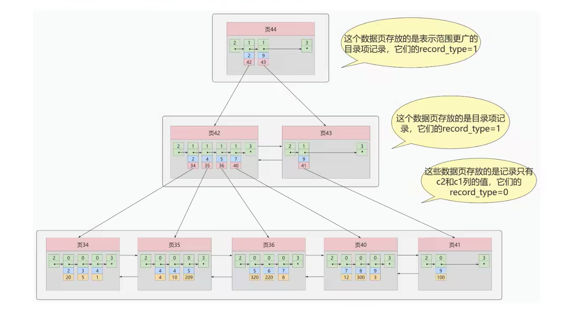

这个B+树与上面的介绍的聚簇索引有几处不同：

- 使用记录c2列的大小进行记录和页的排序，这包括三个方面的含义：
  - 页内记录是按照c2的大小顺序进行一个单向链表。
  - 各个存放用户记录的页也是根据页中记录的c2列大小顺序排成一个双向链表。
  - 存放目录项记录的页分为不同的层次，在同一层次中的页也是根据页中目录项记录的c2列顺序排成一个双向链表。
- B+树的`叶子节点`存储的并不是完整的用户记录，而是`c2列(当前二级索引列)+主键`这两个列的值。
- `目录项记录页`中不在是主键+页号的搭配，而是`c2列+页号`的搭配。

所以如果我们想通过c2列的值查找某些记录的话就可以使用刚才建立的B+树，`查询c2=4的记录，过程如下`：

 1. 确定目录项页

    `从根页44` 快速定位目录记录所在的页42上面（ 二级索引列c2。2<4<9  ）

 2. 通过目录项记录页确定用户记录真实的页

    在页42中，可以快速定位到实际存储用户记录的页，但是由于c2列并`没有唯一约束`，所以c2值可能分布在`多个数据页`，所以可以确定在页34和页35中

3. 在真实存储用户记录的页中定位到具体的记录

   在页34和35中定位到具体的c2列和主键的记录。

4. 但是这个B+树中叶子节点只存储了c2（二级索引）和c1（主键）两个列，所以我们必须在根据主键值去聚簇索引中`再次查询`一次完整的用户记录。

   

**概念：回表**

​	我们根据这个以c2列大小排序的B+树只能确定我们要查找记录的主键值，所以如果我们根据c2列查询完整的记录的话，仍然需要在聚簇索引中在查一遍，这个过程称之为`回表`,也就是根据c2列的值查询一条完整的用户记录需要用到两颗B+树。

**小结：聚簇索引和非聚簇索引的原理不同，在使用上也有一些区别**

1. 聚簇索引的叶子节点存储的就是我们的数据记录，非聚簇索引的叶子节点存储的是数据位置。非聚簇索引会影响数据表的物理存储顺序。
2. 一个表只能有一个聚簇索引，因为只能有一个排序存储的方式，但是可以有多个非聚簇索引，也就是多个索引目录提供数据检索。
3. 使用聚簇索引的时候，`数据查询效率高`,但是如果对数据进行插入、删除更新等操作，效率会比非聚簇索引低。


##### 3.3.3 `联合索引`

我们页可以同时以多个列的大小作为排序规则，也就是同时为多个列建立索引，比方说我们想让B+树按照c2和c3列的大小进行排序，这个包含两层含义：

- 先把各个记录和页按照c2排序
- 在记录的c2列相同的情况下，采用c3列进行排序

为c2和c3列建立的索引示意图如下：

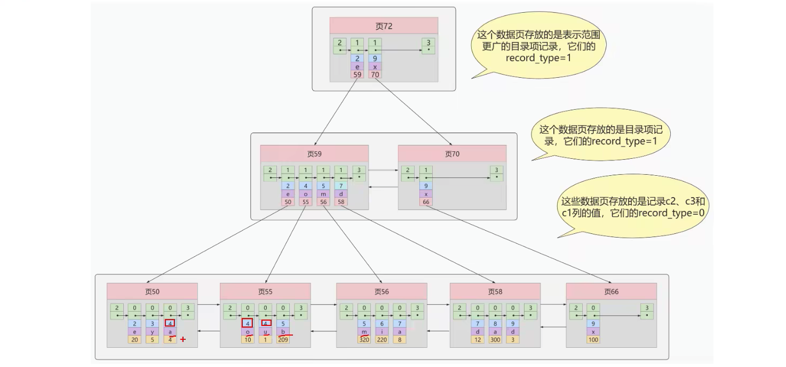


如图所示：

- 每条目录项记录都由c2、c3、页号三个部分组成，各条记录先按照c2列的值进行排序，如果记录的c2列相同则按照c3值排序
- B+树叶子节点处的用户记录由c2、c3和主键c1列组成。

注意一点，以c2、c3的大小为排序规则建立的b+树称为联合索引，本质也是一个二级索引，与普通的二级索引不同的是：

- 建立联合索引只会建立如上图一样的一颗B+树。
- 为c2和c3分别建立索引会分别以c2和c3的大小排序规则建立两颗b+树


#### 3.4 InnoDB引擎的B+树索引的注意事项

##### 3.4.1 根页面位置万年不动

 实际上B+树的形成过程是这样的：

- 每当为某个表创建一个B+数索引的时候，都会为这个索引创建一个`根节点页面`，最开始没有数据的时候，B+树索引对应的根节点中既没有用户记录，也没有目录项记录
- 随后向表中插入用户记录时，先把用户记录存储到这个`根节点`中。
- 当根节点中的可用空间用完继续插入记录，此时会将根节点中的所有记录复制到一个新分配的页，比如页a中。然后对这个新页进行页分裂操作，得到另一个新页，比如页b。这时新插入的记录根据键值(也就是聚簇索引中的主键值，二级索引中对应索引列的值)的大小就会被分配到页a或者页b中，而根节点便升级为目录项记录的页。

特别注意的是：一个B+数自诞生起，便不会在移动，这样只要我们对表进行建立索引，那么他的根节点的页号便会被记录到某个地方，然后凡是InnoDB存储引擎需要用的索引的时候，都会从那个固定的地方取出根节点的页号。从而访问这个索引。

##### 3.4.2 内节点中目录项唯一性

​	为了让新加入的记录找到自己在哪个数据页里，我们必须要保证在B+树里的同一层内的目录项记录除了页号这个字段以外是唯一的，所以对于二级索引的内节点的目录项记录的内容实际上是由三个部分构成的。

- 索引列的值
- 主键值
- 页号


也就是我们把主键值页添加到二级索引内节点中的目录项记录了，这样就能保证B+树每一层节点中各条目录项记录除页号这个字段以外是唯一的。所以最后肯定能定位唯一的一条目录项记录。

##### 3.4.3一个页面最少两条记录

一个B+树只需要很少的层级就可以轻松存储数亿条记录，查询速度相当不错！这是因为B+树本质就是一个大的多层目录，每经过一个目录时就会过滤掉很多无效子目录，知道最后访问到存储真实数据的目录。

那如果一个大的目录中只存放一个子目录是什么效果呢？那就是目录层级非常多，而且最后那个存放真实数据的目录中只能存放一条记录，查询时间很长只为了一条记录，所以InnoDB的一个数据页至少存放两条记录。

 


### 4、MyISAM中的索引方案

<h5>`B树索引适用存储引擎如表所示：`</h5>


| 索引   | MyISAM | InnoDB | Memory |
| ------ | ------ | ------ | ------ |
| B-Tree | 支持   | 支持   | 支持   |

即使多个存储引擎支持同一种索引，但是他们实现的`原理`是不同的。InnoDB和MyISAM默认的索引是`Btree索引`，而Memory默认索引是`HASH索引`。

MyISAM引擎使用B+tree作为索引结构，叶子节点的`data域`存放的是`数据记录的地址`


#### 4.1 MyISAM索引的原理

我们都知道InnoDB引擎中`索引即数据`，也就是聚簇索引的那颗B+树叶子节点中已经把所有完整的用户记录都包含了，而MyISAM的索引方案虽然页使用树形结构，但是却将`索引和数据分开存储`:

- 将表中记录按照记录的插入顺序单独存储在一个文件中，称之为`数据文件`。这个文件并不划分为若干个数据页。有多少记录就往这个文件中塞多少记录，由于插入数据的时候并不需要刻意按照主键大小排序，所以我们`并不能`在这些数据上使用二分法查找。
- 使用MyISAM存储引擎的表会把索引信息另外存储到一个称为索引文件的另一个文件中。MyISAM会单独为表的主键创建一个索引，只不过在索引的叶子节点中存储的不是完整的用户记录，而是`主键值+数据记录地址的组合`。

MyISAM的索引文件仅仅保存数据记录的`地址`，在MyISAM中主键索引和二级索引在结构没任何区别，注视主键索引要求key是唯一，而二级索引的key是可以重复的。

同样是一颗B+树，MyISAM存储引擎中data域保存的并非具体的用户结构，而是数据记录的地址。因此MyISAM中索引检索的算法为：首先按照B+树搜索算法来进行搜索索引，如果指定的key存在，则取出data域的值,然后以data域的值为地址，读取对应地址的数据记录。 


#### 4.2 MyISAM和InnoDB对比

**`MyISAM的索引方式都是"非聚簇"的，与innodb包含一个聚簇索引是不同的.`**

1. 在InnoDB中，我们只需要根据主键值对`聚簇索引`进行一次查找就能找到对应的记录，而在MyISAM中却需要一次回表的操作，意味着MyISAM中建立的索引相当于全是`二级索引`。
2. InnoBD的数据文件本身就是`索引文件`,而MyISAM索引文件和数据文件`是分离的`，索引文件仅保存数据记录的地址。
3. InnoDB的非聚簇索引`data域`存储对应的主键值，而MyISAM存储对应记录的`地址`。换句话说，InnoDB的所有非聚簇索引都引用主键作为data域。
4. MyISAM的`回表操作是十分快`的，因为它拿到的是地址的偏移量去获取数据的，反观InnoDB是通过获取主键之后在去簇聚索引中获取记录，虽然说不页不慢，也比不上直接地址去访问。
5. InnoDB要求`必须有主键（MyISAM可以没有）`，如果没有显式指定，则Mysql会自动选择一个`可以非空且唯一`的数据记录的列作为主键，如果没有，则会自动为InnoDB`生成一个隐式的字段作为主键`，这个长度为6个字节，类型为长整型。


小结：

​	了解不同的存储引擎的索引实现方式对于正确使用和优化索引都是非常有帮助的。比如：

1. 当我们知道innodb索引的实现后，就很容易明白`不建议使用过长字段作为主键`，因为所有的二级索引都是引用的主键索引，过长的主键会令二级索引变得过大。
2. 用非单调的字段作为主键在innodb中也不好，因为innodb本身就是一个b+树，非单调主键会造成在插入新纪录时，数据为了维持B+tree的特性而频繁的分裂调整，十分低效。而使用自增字段作为主键式非常好的方式。

### 5、索引的代价

**`索引是个好东西，但是不能乱建，他在空间和时间上都会有消耗。`**

- 空间上的代价
  - 每次建立索引都要为它建一颗B+树，每一颗B+树的每个节点都是数据页，一个页默认会占用16KB的空间，一颗很大的B+树由许多数据页组成，那就是一片`很大的存储空间`
- 时间上的代价
  - 每次对表的数据进行增删改查，都需要去修改各个B+树索引。而我们说过，B+树每层节点都是按照索引列的顺序排序组成的`双向链表`。不论是叶子节点的记录，还是内节点的记录都是按照索引列的值从小到大的顺序形成了一个单向链表，而增删改的操作可能会对节点和记录的排序造成破坏，所以存储引擎需要额外的时间进行一些`记录移位、页面分裂、页面回收`等的操作来维护好节点和记录的排序。如果我们建立了许多索引，每个索引对应B+树都要进行相关的维护，给性能拖后腿.

> 一个表的索引建立的越多，就占用越多的存储空间。再增删改的时候性能就会越差，为了建立又好又少的索引，我们得学学这些索引是在那些条件下起作用的。


### 6、MySQL数据结构选择的合理性

从MySQL的角度来讲，不得不考虑的一个现实的问题就是磁盘的IO，如果我们能让索引的数据结构尽量的减少硬盘的IO操作，所消耗的时间也就越少，可以说磁盘的IO操作次数对索引的使用效率至关重要。

查找都是索引操作，一般来说索引非常大，尤其是关系型数据库，当数据量比较大的时候，索引的大小有可能几个G甚至更多，为了减少索引在内存中的占用，数据库索引是存储在外部磁盘的，当我们利用索引是不可能把整个索引全部加载到内存，只能逐一加载，那么Mysql衡量查询效率的标准就是IO次数。

#### 6.1 全表遍历

进行顺序的全表扫描每行数据

#### 6.2 Hash结构

hash本身是一个函数，又被称为散列函数，它可以帮助我们大幅提升检索数据的效率。

Hash算法是通过某种确定性的算法（如：MD5、SHA1、SAH2、SAH3）讲输入转变为输入。相同的输入永远可以得到相同的输出，假设输入内容有微小的偏差，在输出种通常都会有不同的结果。

加速查找速度的数据结构，常见的有两类：

1. 树,例如平衡二叉树，查询插入修改和删除的平均时间复杂度都是o(log2n);
2. 哈希，例如HashMap(`无序`)，查询插入修改删除的平均时间复杂度是都o(1);

采用Hash进行检索效率非常高，基本上一次检索就可以找到数据，而B+树需要自顶向下一次查找，多次访问节点才能找到数据，中间需要多次IO，从效率来讲Hash比B+树更快。


Hash结构效率高，那么为什么索引结构要设计成树型呢？ 原因如下：

1. Hash索引仅能满足（=、<>）和in查询。如果进行范围查询，哈希型索引，时间复杂化会退化为O（n）而树型的有序特性，依然能保持O（log2n）的高效率。
2. Hash索引还有一个缺陷，数据的存储是没有顺序的，在OrderBy的情况下，使用Hash索引还需要对数据进行重新排序。
3. 对于联合索引的情况，Hash值是将联合索引键合并后一起计算的，无法对单独的一个键或者几个索引键来查询。
4. 对于等值查询来说，通常Hash索引的效率更高，不过也存在一种情况，就是`索引列的重复值如果很多，效率就会降低`。这是因为遇到Hash冲突时，需要遍历桶中的行指针来比较，找到查询的关键字，非常耗时。所以Hash索引通常不会用到重复值多的列上，比如列为性别、年龄的情况


#### 6.3 二叉搜索树

我们利用二叉树来作为搜索条件，那么磁盘的IO次数和索引树的高度是相关的。

1. 二叉搜索树的特点

   - 一个节点只能有两个子节点，也就是一个节点度不能超过2
   - 左子节点< 本节点;右子节点>=本节点，比我大的向右，比我小的向左。

2. 查找规则

   我们先来看看最基础的二叉搜索树，搜索某个节点和插入节点的规则一样，我们也假设搜索插入的数据为key：

   - 如果key大于根节点，则在右子树查找；
   - 如果key小于根节点，则在左子树查找；
   - 如果key等于根节点，直接返回根节点。 


我们对一个数列（34,22,89,5,23,77,91）创造出来的一个二分查找树如下：

 

二叉树搜索也存在特殊情况，有时候二叉树的搜索深度非常大，比如我们给的数列的 顺序是（2,22,23,34,77,89,91） 如图：

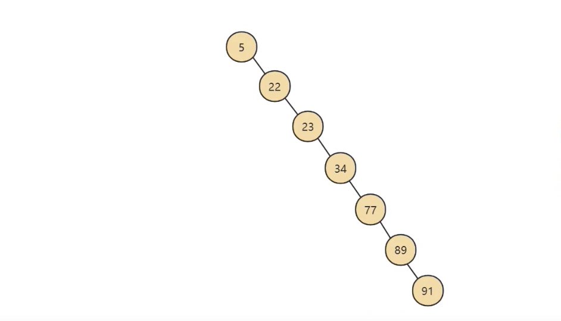

虽然也属于二分查找树，但是性能上已经退化成一个链表，那么查询的数据的时间复杂度变成了O(n). 为了提高查询效率，就需要减少磁盘的IO数，为了减少磁盘的io，就需要降低树的高度，需要把原来瘦高的树结构变得矮胖，树的每层分叉越多越好。

引入AVL树。

#### 6.4 AVL树

为了解决上面二叉树退化成链表的问题，人们提出了平衡二叉搜索树，又称为AVL树，它在二叉搜索树的基础上增加了约束，具有一下特点：

- `它是一颗空树或它的左右子树的高度差的绝对值不超过1，并且左右两个子树都是一个平衡二叉树`

这里说一下，常见的平衡二叉树有多种，包括`平衡二叉搜索树、红黑树、数堆、伸展树`。平衡二叉搜索树是最早提出来的自平衡二叉树,当我们提到平衡二叉树时，一般是指的平衡二叉搜索树。事实上第一棵树就属于平衡二叉搜索树，搜索时间复杂度就是O(log2n)。

数据查询的时间主要依赖于磁盘Io的次数，如果我们采用二叉树的形式，即使通过平衡二叉搜索树进行了改进，树的深度也是O(log2n)，当n比较大时深度也是比较高的。如图所示：


`每访问一次节点就需要对磁盘进行一次IO`，对于上面的树来说，我们需要进行5次IO 虽然平衡二叉树的效率高，但是树的深度也很高，就意味着io的次数多，会影响整体的一个效率。

针对同样的数据，如果我们把二叉树改成M叉树(M>2)呢 当m=3时，同样的31个节点可以有下面的三叉树来进行存储：

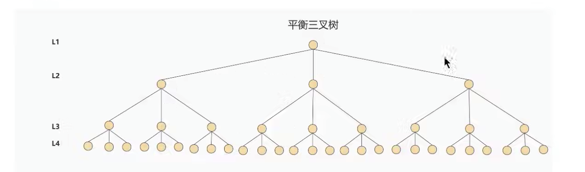

你能看到此时树的高度降低了，当数据量n大的时候，以及树的分叉树M大的时候，M叉树的高度会远小于二叉树的高度(M>2).所以，我们需要把`树从瘦高变成矮胖`。 

 引入B树。

#### 6.5 B-Tree

B树的英文是Balance tree，也就是多路平衡查找树。简写就是B-Tree。他的高度远远小于平衡二叉树的高度。B树的结构如图：

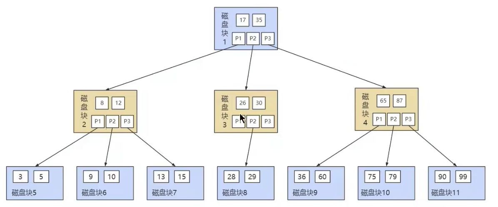


B树作为`多路平衡查找树`,它的每一个节点最多包括M个子节点，M称为B树的阶。每个磁盘种包括了`关键字`和`子节点的指针` 。如果一个磁盘块中包括了x个关键字，那么指针树就是x+1。对于一个100阶的B树来说，如果有三层的话最多可以存储大约100万的索引数据。对于大量的索引数据来说，采用b树的结构是非常适合的，因为树的高度远小于二叉树的高度。

1. B树在插入和删除节点的适合如果导致树不平衡，就通过自动调整节点的位置来保持树的自平衡。
2. 关键字集合分布在整个树中，即叶子节点和非叶子节点都存放数据。搜索有可能在非叶子节点结束。
3. 其搜索性能等价于在关键字全集内做一次二分查找。


与B+树的区别在于，B+树的所有数据都在叶子节点存储，而B树则叶子节点和非叶子节点都存放数据。

#### 6.6 B+Tree

B+ 树也是一种`多路平衡查找树`,基于B树做出了改进，主流的DBMS都支持B+树的索引方式，比如Mysql。相比较B-Tree，`B+Tree更适合文件索引系统`。


B+树和B树的`差异`在于以下几点：

1. 有k个孩子(叶子节点数据页)的节点就有k个关键字(目录项记录)。也就是孩子数量=关键字，而B树中，孩子数量=关键字+1。
2. B+树中非叶子节点的关键字也会同时`存在子节点中`，并且是子节点中所有关键字的最大（或最小）。
3. 非叶子节点仅仅用于索引，`不保存数据记录`，跟记录有关的信息都存放在叶子节点中。而B树中非叶子节点即保存索引，`也保存数据记录`。
4. 所有关键字都在叶子节点出现。叶子节点构成一个有序链表，而且叶子节点本身按照关键字`从小到大顺序链接`。

B+树和B树有个根本性的差异在于,**`B+树的中间节点并不直接存储数据`**。这样有什么好处呢？

​	首先，`B+树查询效率更稳定`。因为B+树每次只有访问到叶子节点才能找到对应的数据，而在B树种，非叶子节点也会存数据，这样就会造成查询效率不稳定的情况，有时候访问到非叶子节点就能找到数据，而有时候需要访问到叶子节点。

​	其次。`B+树的查询效率更高`，这是因为通常B+树比B树更加的矮胖(阶数更大，深度更低)，查询所需要的磁盘IO也会更少，同样的磁盘页大小，B+树可以存储更多的节点关键字。

​	不仅是对单个关键字的查询上，在`查询范围上B+树的效率也比B树高`，，这是因为所有关键字都出现在B+树的叶子节点，叶子节点之间会有指针，数据又是递增的，这使得我们范围查找可以通过指针链接查询。而在B树中则需要中序遍历才能完成查询范围的查找，效率要低很多。

> B树和B+树都可以作为索引的数据结构，在Mysql 中采用的是B+树。
>
> 但是B树和B+树都有自己的应用场景，也不能说B+树就一定比B树好。

`思考： 为了减少io ，索引树会一次性加载吗？`

1. 数据库索引是建立在磁盘上的，如果数据量很大，必然导致索引的大小也会很大，超过几个G。
2. 当我们利用索引查询的时候，是不可能讲全部的几个G的索引都加载进内存的，我们能做的只能是，逐一加载每个磁盘页，因为磁盘页对应着索引树的节点


`思考： B+树的存储能力如何？为何说一般查找行记录，最多只需要1~3次磁盘I/O?`

​	InnoDB存储中页的大小为16KB，一般表的主键类型为int(4个字节)或BIGINT(8个字节),指针类型也一般为4或8个字节，也就是一个数据页中大概存储16KB/(8b+8b)= `1k` 个键值，因为是一个估值，为了方便计算，这里的K取值为10^3. 也就是说一个`深度为3`的B+Tree索引可以维护10^3 * 10^3 * 10^3=`10亿`条记录。 在`实际情况中` 每个节点可能不能填充满，因此在数据库中，B+Tree的高度一般是1~4层。Mysql的InnoDB存储引擎在设计时是讲根节点常驻内存的，也就是在查找时最多再进行1-3次磁盘的IO。


`思考:为什么说B+树比B树更适合实际应用中操作系统的文件索引和数据库索引？`

	1. B+树的磁盘读写代价更低。
	1. B+树的查询效率更稳定。


`思考:Hash索引与B+树索引的区别？`

 	1. Hash索引`不能进行范围性`的一个查找，因为hash指向的数据是`无序`的，而B+树的叶子节点是个有序的链表。
 	2. Hash索引`不支持联合索引的最左侧原则`(即联合索引的部分索引无法使用)，而B+树可以。对于联合索引来说，Hash索引在计算Hash值得时候将索引键合并后再一起计算Hash值，所以不会针对每个索引单独计算hash值。因此如果用到联合索引的一个或者多个索引时，无法被利用。
 	3. Hash不支持OrderBy排序，以为Hash索引指向的数据无序，因此无法起到排序的作用。而B+树索引数据是有序的，可以起到对该字段order by排序优化的作用，同理，我们也无法对hash索引进行`模糊查找`,而B+树使用模糊查询的方式时，like后面后模糊查询的话就可以起到优化作用。
 	4. InnoDB不支持Hash索引。

#### 6.8 小结

​	使用索引可以帮助我们从海量的数据中快速的定位到我们想要的数据，不过索引也存在一定的不足，比如占用存储空间、降低数据库写操作的性能等，如果有多个索引还会增加索引选择的时间。当我们使用索引时，需要平衡索引的利(查询效率)和弊(维护索引的代价)。

​	 在实际工作中，我们还需要基于需求和数据本身的分布情况来确定是否使用索引，尽管索引不是万能，但是数据量大的时候不使用索引是不可想象的，毕竟索引的本质，是帮助们提升数据检索的效率。


### 7、InnoDB的数据存储结构

####  7.1 数据库的存储结构：页

​	索引数据结构给我们提供了高效的索引方式，不过索引信息以及数据记录都是保存在文件上的，确切的说是存储在页结构中。另一方面，索引是在存储引擎中实现的，Mysql服务器的存储引擎负责对表中数据的读取和写入工作。不同存储引擎中存放的格式一般是不同的，甚至有的存储引擎比如：Memory都不用磁盘来存储数据。

##### 	7.1.1 磁盘与内存交互基本单位：页

​	InnoBD将数据划分为若干个页，InnoDB中也得大小默认是`16KB`.

以页作为磁盘和内存之间交互的基本单位，也就是一次最少从磁盘读取16kb的内容到内存中，一次最少把内存中的16kb内容刷新到磁盘中。也就是说，`在数据库中，不论是读一行，还是读多行，都是将这些行所在的页进行加载。也就是说，数据库管理存储空间的基本单位是页，数据库IO操作的最小单位是页`。一个页中可以存储多行记录。

> 记录是按照行来存储的，但是数据库的读取并不以行为单位，否则一次读取(一次IO操作)只能处理一行数据，效率非常低。


##### 	7.1.2 页结构的概述

​	页可以`不在物理结构上相连`，只要通过`双向链表`相关联即可。每个数据也中的记录会按照主键值从小到大的顺序组成一个`单向链表`，每个数据页都会为存储在它里面的记录生成一个页目录，在通过主键查找某条记录的时候可以在`页目录中`使用`二分法`快速定位到对应的槽，然后在遍历该槽对应分组中的记录即可快速找到指定的记录。

##### 	7.1.3 页的大小

​	不同的数据库管理系统(简称DBMS)的页大小不同，比如在Mysql 的innodb存储引擎中，默认页的大小是16kB 我们可以通过以下命令查看：

```mysql
show variables like "%innodb_page_size%"
```


SQL server中页的大小为8kb，而在oracle中我们用术语’块‘（Block）来代表页，oracle支持的块大小为2kb、4kb、8kb、16kb、32kb和64kb。

##### 	7.1.4 页的上层结构

​	在数据库中，还存在着区、段、和表空间的概念。行、页、区、段、表空间的关系如图所示：

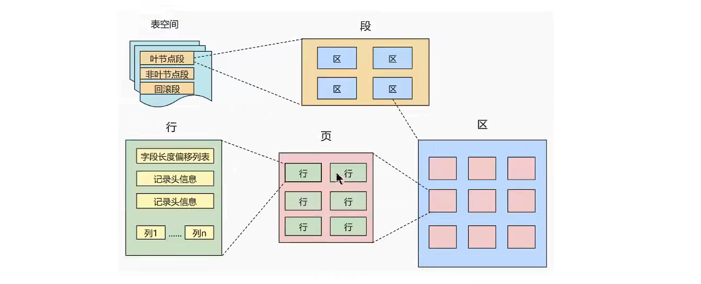

​	

区(Extent) 是比页大一级的存储结构，在InnoDB中，一个区会分配64个连续的页。因为InnoDB中的页默认大小是16kb，所以一个区则是64*16KB=1MB

段(Segment)由一个或多个区组成，区在文件系统是一个连续分配的空间(在innodb中是连续的64个页)，不过在段中`不要求`区与区之间是相邻的。`段是数据库中的分配单位，不同类型的数据库对象以不同的段形式存在`。在我们创建数据库、索引的时候，就会相应的创建对应的段，比如创建一张表时会创建一个表段，创建一个索引时会创建一个索引段。

表空间(tablespace)是一个逻辑容器，表空间存储的对象是段，在一个表空间中可以有一个或多个段，但是一个段只能属于一个表空间。数据库由一个或者多个表空间组成，表空间从管理上可以划分为`系统表空间`、`用户表空间`、`撤销表空间`、`临时表空间`等。


#### 7.2 页内部结构

页如果按照类型来划分，创建的有`数据页(保存B+树节点)、系统页、Undo页和事务数据页`等，数据叶是我们最常使用的页。

数据页16KB大小的存储空间被划分为`7个部分`，分别是文件头(File Header)，页头(Page Header)，最大最小记录(Infimum+supremum)、用户记录(User Records)、空闲空间(Free Space)、页目录(Page Directory)和文件尾(File Trailer)。

页的示意图如下：


这7个部分作用分别如下，我们简单的梳理一下：

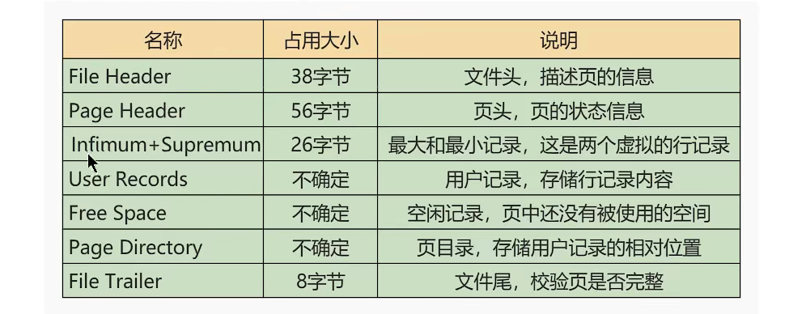


我们可以把这7个结构分成3个部分。

##### 7.2.1 第一部分：文件头(File Header)和文件尾(File Trailer)

首先是文件`通用部分`，也就是文件头和文件尾

###### 	①：文件头部信息

​	不同类型的页都会以File Header作为第一个组成部分，它描述了一些针对各种页都通用的一些信息，比如说这个页的编号是多少，它的上一个页、下一个页是谁等，所有的数据页会组成一个双链表。这个部分占用固定的28个字节，是由下面这些内容组成的

###### 	②：文件尾信息


##### 7.2.2 第二部分：

###### 	①：Free Space（空闲空间）


###### 	②：User Records（用户记录）

User Records中的这些记录按照指定的航哥是一条条摆在User Records部分，相互之间形成单链表。


###### ③：Infimum + Supremum（最大最小记录）

InnoDB规定的最大最小记录构造十分简单，都是由5字节大小的记录头信息和8字节大熊啊的一个固定部分组成，

这两条记录不是我们自定义的记录，所以不存放在User Records部分，它被单独放在一个Infimum + Supremum的部分。


##### 7.2.3 第三部分：

###### 	①：Page Directory（页目录）

页目录： 1. 将整个页中所有的记录分成几个组，这些记录包括最小最大记录。

​		2. 第一组也就是 页最小记录所在的分组只有一个记录

​			最后一组，也就是最大记录所在的分组，会有1~8个记录

​			其余组的记录数量在4~8条记录之间

​        	这样做的好处就是除了第一组以外，其他组的记录数会尽量平分

		3. 在每个组中最后一条记录的头信息中会存储该组一共多少记录,作为n_owned字段
		3. `页目录用来存储每组最后一条记录的地址偏移量`，这些地址偏移量会按照先后顺序存储起来，每组的地址偏移量页被称为槽（slot），每个槽相当于指针指向了不同组的最后一个记录。


###### 	②：Page Header（页面头部）

​	为了能得到一个数据也中存储的记录的状态信息，比如本页中存储了多少记录，第一个记录的地址是多少。多少个槽等。特意在页中定义了一个叫Page Header 的部分 占用固定的56个字节，用来存储各种状态信息。


### 8、索引的创建与设计原则

#### 8.1 索引的声明与使用

##### 8.1.1 索引分类


mysql 的索引包括普通索引、唯一索引、全文索引、单列索引、多列索引和空间索引等。

- 从功能逻辑上说，索引主要有四种，分别是普通索引、唯一索引、主键索引、全文索引。
- 按照物理实现方式，索引可以分为2种：聚簇索引和非聚簇索引。
- 按照作用字段个数划分：单列索引和联合索引。

1. `普通索引`

   在创建普通索引时，不附加任何限制条件，只是提高查询效率。这类索引可以创建在任何数据类型中，其值是否唯一或非空，由字段本身的完整性约束条件决定。建立索引以后。可以通过索引进行查询。

2. `唯一性索引`

   使用`UNIQUE` 可以设置索引为唯一性索引，在创建唯一性索引时，限制索引的值必须是唯一的，但是允许有空值。在一张表里`可以有多个`唯一索引。

3. `主键索引`

​	主键索引就是`一种特殊的唯一性索引` ，在唯一索引的基础上增加了不为空的约束，也就是NOT NULL + UNIQUE,一个表里最多只有一个主键索引。

​	这是由主键索引的物理实现方式决定的，因为数据存储在文件中只能按照一种顺序进行存储。

4. `单列索引`

​	在表的单个字段创建索引。单列索引只根据当前字段进行索引，可以是普通索引，也可以是唯一性索引，还可以是全文索引，只要保证对应一个字段即可，可以有多个单列索引


5. `多列索引`

​	多列索引在表的多个字段组合上创建一个索引。该索引指向创建时对应的多个字段，可以通过这几个字段进行查询，但是只有查询条件中使用了第一个字段时才会被使用，需要遵循最左原则

6. 全文索引

​	全文索引是目前搜索引擎使用的一种关键性技术，能够利用【分词技术】等多种算法智能分析出文本文字中关键词的频率和重要性，按照一定的算法规则智能的筛选出我们想要的结果，全文索引非常适合大型数据集，对于晓得数据集，用处比较小。

​	使用FULLTEXT可以设置索引为全文索引，早定义索引的列上支持值得全文查找，允许这些索引列中插入重复值和空值。全文索引只能创建在char、varchar或text上，查询数据量较大的字符串时，使用全文索引可以提高查询速度。

​	全文索引典型的有两种类型：自然语言的全文索引和布尔全文索引。

7. 补充：空间索引

使用参数SPATIAL可以设置为空间索引，空间索引只能建立在空间数据类型上： GEOMETRY、POINT、LINESTRING等。


**小结：**

​	innodb ：支持B-tree、Full-text等索引  不支持hash索引

​	MyISAM : 支持B-tree、Full-text等索引  不支持hash索引

​	Memory ：支持B-tree、hash等索引  不支持Full-text索引

​	NDB ：支持hash索引  不支持B-tree、Full-text等索引


##### 8.1.2 使用索引

###### 1.创建表的时候创建索引

#隐式创建索引

```mysql
#直接在字段上声明
CREATE TABLE table_name(
	id int PRIMARY KEY AUTO_INCREMENT,   #主键key  自增
  name varchar(10) UNIQUE,    #唯一性索引
)

#在字段后面生明
CREATE TABLE table_name(
	id int,
  name varchar(1000),
#  声明索引
#  INDEX index_id(id) 普通索引
#  UNIQUE INDEX index_id(id) 唯一索引
#  INDEX index_id_name(id,name) 联合索引
# 	FULLTEXT INDEX index_name(name(50)) 	全文索引 针对字符串的前五十个字符
)
```


#显式创建索引

```mysql
CREATE TABLE table_name [col_name data_type]
[UNIQUE | FULLTEXT | SPATIAL] [INDEX | KEY] [index_name] (col_name [length]) [ASC | DESC]
```

- `UNIQUE | FULLTEXT | SPATIAL` 为可选参数，分别表示唯一索引、全文索引、和空间索引。
- `INDEX | KEY`  为同义词，作用相同，用来指定索引。
- `index_name`   为可选参数,指定索引的名称，不指定则用col_name（字段）名为索引名。
- `col_name`     为需要创建索引的字段，该列必须从数据表定义的多个列中选择。
- `length`       为可选参数，表示索引的长度，只有字符串类型的字段才能指定
- `ASC | DESC`   置顶升序或者降序的索引值存储


~~~mysql
#在创建完表之后声明索引
CREATE TABLE table_name(
	id int,
  name varchar(1000),
)
#第一种
ALTER TABLE tableName ADD INDEX index_id(id);  #普通索引
ALTER TABLE tableName ADD UNIQUE INDEX index_id(id); #唯一索引
ALTER TABLE tableName ADD  INDEX index_id_name(id,name); #联合索引

#第二种
CREATE INDEX index_id ON tableName(id);
CREATE UNIQUE INDEX index_id ON tableName(id);
CREATE INDEX index_id_name ON tableName(id,name); 


~~~

###### 2.查看索引

```mysql
#一
SHOW CREATE TABLE tab_name;
#二
SHOW INDEX FROM tab_name;
```

###### 3.删除索引

```mysql
#### 添加有AUTO_INCREMENT约束的唯一索引不能被删除

#方式一
ALTER TABLE tableName  DROP PRIMARY KEY;   #删除主键   如果有自增，需要先删除自增

ALTER TABLE tableName  DROP INDEX index_name;   # 删除索引
#方式二
DROP INDEX  index_name ON tableName;
```


#### 8.2 Mysql8 索引的新特性

##### 8.2.1 支持降序索引（innodb）

降序索引以降序存储键值，虽然在语法上从4.0就支持降序的语法，但实际上desc定义是被忽略的，从8.0才开始真正支持降序索引(仅限于innodb)。

Mysql在8.0之前创建的仍然是升序索引，使用时进行反向扫描，大大降低了数据库效率。在某些场景下，降序意义重大。例如一个查询需要多个列排序，且顺序不一致，那么使用降序索引将会避免数据库使用额外的文件来排序操作，从而提升效率。

~~~mysql
CREATE TABLE table_name(
	a int,
  b int,
#  声明索引
  INDEX index_a_b(a ASC,b DESC) # 联合升降序索引
)


SELECT * from tab order by a asc, b desc
~~~


##### 8.2.2 隐藏索引

Mysql从 8.0 开始支持`隐藏索引` 只要将待删除的索引设置为隐藏索引。使优化器不再使用这个索引，确认将索引设置为隐藏索引后系统不受影响，就可以彻底删除。`这种通过先将索引设置成隐藏索引，在删除索引的方式就是软删除`.

同时，如果想验证某个索引删除之后`查询性能影响`,就可以先隐藏该索引。

> 注意：
>
> ​	主键不能被设置为隐藏索引，当表中没有显式主键时，表中第一个唯一非空索引会成为隐式主键，也不能设置为隐藏索引。

索引默认是可见的，使用CREATETABLE，等语句时可以通过`VISIBLE`或者 `INVISIBLE`关键词设置索引的可见性。

```mysql
#在创建表时声明索引
CREATE TABLE tableName(
	id int,
  name varchar(1000),
  INDEX index_id(name) invisible
)

#在创建完表之后声明索引
ALTER TABLE tableName ADD INDEX index_id(id) invisible


#修改索引可见性
ALTER TABLE tableName ALTER INDEX index_id invisible  #设置index_id 设置为隐藏索引
ALTER TABLE tableName ALTER INDEX index_id visible  #设置index_id 为可见索引

```


#### 8.3 索引设计的原则

为了使索引的使用效率更高，在创建索引时，必须考虑在那些字段上创建和创建什么样的索引，`索引设计不合理或者缺少索引都会对数据库和应用程序的性能造成障碍`。高效的索引对于获得良好的性能非常重要，设计索引时，应考虑相应的准则。


##### 8.3.1 数据准备

##### 8.3.2 那些情况适合创建索引

###### 	1. 字段的数值有唯一性限制

​	索引本身可以起到约束的作用，比如唯一索引、主键索引都是可以起到唯一性约束，因此在我们的数据表中如果`某一个字段是唯一的`，就可以直接`创建唯一性索引`，或者`主键索引`,这样可以更快速的通过该索引来确定某条记录。

> 业务上具有唯一性的字段，即使是组合字段，也必须建成唯一索引。
>
> 说明：不要认为唯一索引影响了insert速度，这个速度损耗可以忽略，但提高查询速度是非常明显的。

###### 	2. 频繁作为where查询条件的字段

​	某个字段在select语句的where条件中经常被使用到，那么就需要给这个字段创建索引了。就其实在数据量大的情况下，创建普通索引就可以大幅提升数据查询的效率。

 

###### 	3. 经常groupby和orderby的列

​	索引就是让数据按照某种顺序进行存储或检索，因此当我们使用GROUP BY对数据进行分组查询时，或orderby排序时，就需要对分组或者排序的字段进行索引。如果待排序的列有多个，可以建立组合索引。

​	那如果同时有groupby 和orderby 的情况下，创建创建一个组合索引要比各个字段的单列索引效率高的多。 创建联合索引时 以groupby的字段为第左原则，在8.0中可以order 的排序规则（asc或desc）

 

###### 	4. Update、delete的where条件列

​	当我们对某数据进行update或者delete操作的时候，对于where条件添加索引，效率会提升不少。

​	对数据按照某个条件进行查询后再进行update或delete，如果对where条件创建索引，就能大幅度提升效率，原理是因为我们需要先根据where 条件列检索出来这条记录，然后在对他进行更新或删除，`如果进行更新的时候，更新的字段是非索引字段，提升的效率会更明显，这是因为非索引字段不需要对索引树进行维护`。 

###### 	5. DISTINCT字段需要创建索引

​	有时候我们需要对某个字段进行去重，使用distinct，那么对这个字段创建索引，会提升查询效率。

​	

###### 	6. 多表join连接操作时，创建索引注意事项

 1. 首先，`连接表的数量尽量不要超过3张`，因为每增加一张表就相当多了一次嵌套的循环，数量级增长会非常快，严重影响查询的效率。

 2. 其次，`对于where条件创建索引`，因为where才是对数据条件的过滤。如果在数据量非常大的情况下，没有where条件过滤是非常可怕的。

 3. 最后，`对用于连接的字段创建索引`，并且该字段在多张表中的`类型必须一致`。

    如果类型不一致则会有隐式的转换，一旦内部使用函数时，索引就会失效


###### 	7. 使用列的类型小的创建索引

​	这里所说的类型大小是指该类型表示的数据范围的大小。

​	我们在定义表结构的时候要显式的指定列的类型，以整数类型为例：有tinyint 、mediumint、int、bigint等，它们占用的存储空间依次递增，能表示的整数范围也是一次递增，如果我们对某个整数列建立索引的话，在表示的整数范围允许的情况下，尽量让索引列使用小的类型，比如能使用int 就不用bigint，这是因为：

	- 数据类型越小，查询是进行的操作越快
	- 数据类型越小，索引占用的存储空间越小，在一个数据页内就可以放更多的记录。从而减少IO带来的性能损耗，也就意味着可以把更多的数据也缓存到内存，加快读写效率。

这个建议对于表`主键来说更适用`，因为不仅是聚簇索引中会存储主键值，其他所有的二级索引的节点处也会存储主键，如果主键实用更小的数据类型，就意味着节省更多的存储空间和高效的I/O.


###### 	8. 使用字符串前缀创建索引

​	假设我们的字符串很长，那存储一个字符串就需要占用更大的存储空间，在我们需要为这个字符串列建立索引时，就意味着在对应的B+树种有这么两个问题：

	- B+树索引中的记录需要把该列的完整字符串存储起来，更加费时。而且字符串越长，`在索引中占用的存储空间越大`
	- 如果B+树索引中索引列存储的字符串很长，那么在`字符串比较时会占用更多时间`。

我们可以通过截取字段前面一部分内容建立索引，这个就叫`前缀索引`，这样在查找记录是虽然不能精确的定位到记录的位置，但是能定位到相应前缀所在位置，然后根据前缀相同的记录的主键值回表查询完整的字符串值。既`节约空间`又`减少了字符串的比较时间`，还大体能解决排序问题。

​	

​	使用字符串前缀时需要注意： 

	1. 索引的长度与区分度是一对矛盾体，一般对字符串类型数据，长度为20的索引，区分度高达`90%以上`可以使用count(distinct left(列名 索引长度))/count(*)的区分度来确定具体长度。
	1. 在使用前缀索引时，如果在排序之后进行limit时，如果limit与前缀索引的长度一致了，可能就会出现数据误差。

​	

###### 	9. 区分度（散列性高）的列适合作为索引

​	`列的基数` 指的是某一列中不重复数据的个数，比如说：某个列包含2,5,8, 2,5,8, 2,5,8。虽然有9个记录，但是基数却是3。也就是说，`在记录行数一定的情况下，列的基数越大，该列的值越分散；列的基数越小，该列中的值越集中`，这个列的基数指标非常重要，直接影响我们是否有效的利用索引，最好为列的基数大的列建立索引，基数小的列建立索引效果可能不好。

可以使用公式 `select count(distinct 列名)/count(*) from tableName` 计算区分度，越接近1越好。一般超过`33%` 就算比较高效了

扩展：联合索引把区分度高的列放前面


###### 	10. 使用最频繁的列放在联合索引的左侧

​	这样页可以较少的建立一些索引，同时，由于’最左前缀原则‘，可以增加联合索引的使用率。

###### 	11. 多字段创建时，联合索引优于单列索

##### 8.3.3 限制索引数目

实际工作中，我们也需要注意平衡，索引的数目不是越多越好。我们需要限制每张表的数量，建议单表的索引数`不超过6个`.原因如下：

- 每个索引都需要占据磁盘空间，索引越多，需要磁盘空间越大。

- 索引会影响insert、update和delete等的性能，因为表中数据更改的同时，索引也会进行调整和更新，会造成负担。

- 优化器在选择如何优化查询时，会根据统一信息，对每个可以用到的索引进行评估，以生成出一个最好的执行计划，如果同时有很多索引都可以用于查询，会增加mysql优化器生成执行计划时间，降低查询性能。

  ​	

##### 8.3.4 那些情况不适合创建索引

1. 在where中使用不到的字段，不要设置索引

   where条件（包括groupby\orderby）里用不到的字段不需要创建索引，索引的价值是快速定位，如果起不到作用通常不需要索引。

2. 数据量小的表最好不要使用索引

   如果表记录少，是否创建索引`对于查询效率的影响并不大`

3. 有大量重复数据的列上不要建立索引

    在条件表达式中疆场用到的不通知较多的列上建立索引，但是字段中如果有大量重复数据，也不用创建索引。如果建立索引，不但不会提高查询效率，反而会`严重减低数据的更新速度`。

   > 当数据重复度大，比如高于10%的时，就不需要对这个字段使用索引

4. 避免对经常更新的表创建过多的索引

   - 频繁更新的字段不一定要创建索引。因为更新数据时，也需要更新索引，如果索引过多，在更新索引的时候也会造成负担，影响效率。
   - 避免对经常更新的表创建索引，并且索引中的列尽可能的少。此时，虽然提升了查询速度，同时会减低更新速度。

5. 不建议用无序的值作为索引

6. 删除不在使用或者很少使用的索引

7. 不要定义冗余或重复的索引	

##### 8.3.5 小结：

索引是一把双刃剑，可以提高查询效率，但是会降低插入和更新的速度，并占用磁盘空间。

选择索引的最终目的是为了使插叙你的速度变快，上面给出的原则是最基本的准则，但是不能拘泥于上面的准则，根据实际的情况进行分析和判断，要使用最适合的索引方式。


## 数据库性能分析工具

在数据库调优中，我们得目标就是响应时间更快、吞吐量更大。利用宏观的监控工具和微观的日志分析可以帮我们快速找到调优思路和方式

### 1、数据库服务器的优化步骤

当我们遇到数据库调优问题的时候，该如何思考呢? 流程整理如下图：

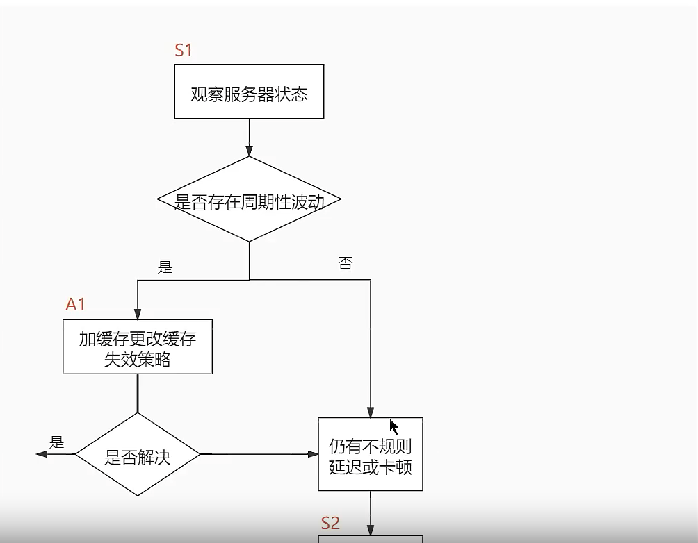

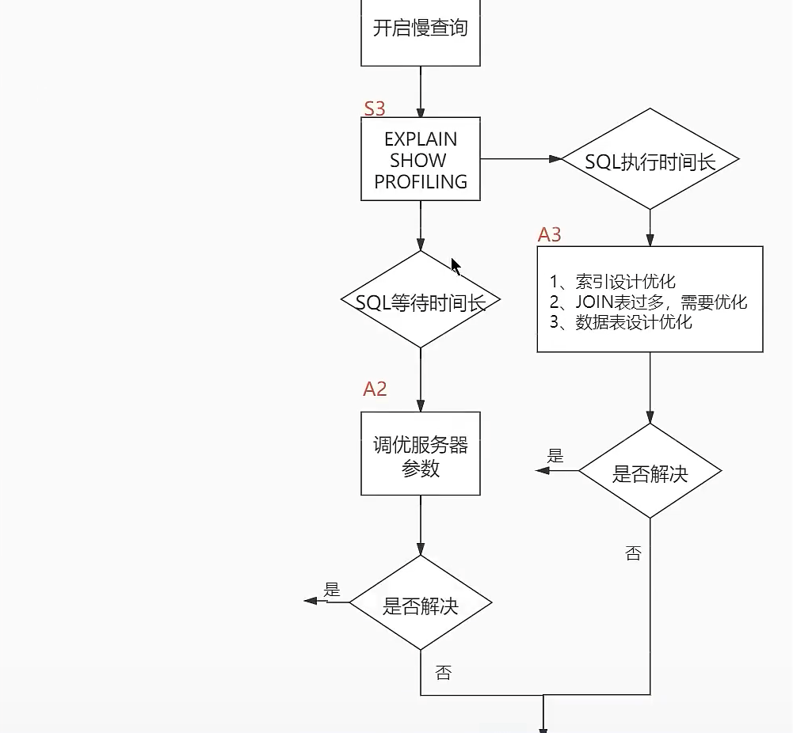


我们可以通过观察了解数据库整体的运行状态，通过性能分析工具可以让我们了解执行慢的sql都有哪些，查看具体的sql执行计划，甚至是sql执行中的每一步的成本代价,这样才能定位问题所在，采取相应的措施。

解释一下此图：

	- 首先在S1部分，我们需要观察服务器状态是否存在周期性波动，如果`存在周期性波动`，有可能就是周期性节点的原因，比如各种促销活动等。这样的话，就通过A1步骤解决，就是加缓存，或者更新缓存策略，
	- 如果不是周期性波动的原因，就需要进一步分析`查询延迟和卡顿的原因`.接下来进入S2这步，需要开启慢查询，帮我们定位执行慢的sql语句，通过设置`long_quey_time`参数定义慢的阈值，如果超过了这个时间，则认为是慢查询，当收集这些慢sql后，就可以对其进行分析。
	- 在s3这步骤中，就可以针对性的用`explain`查看对应sql语句的执行计划，或者使用`show profile` 查看sql中每个步骤的时间成本，就可以了解到时执行时间长还是等待时间长，
	- 如果等待时间长，则进入A2步骤，在这里可以`调优服务器参数`比如适当增加数据库缓冲池等。如果sql执行时间长，就进入A3步骤，在这里就需要考虑到底是索引设计的问题？还是查询关联的表过多，还是表字段设计问题？然后再这些维度上调整。
	- 如果A2和A3都不能解决问题，就需要考虑数据库自身的sql查询性能是否已经瓶颈，如果达到了就进入A4阶段，考虑`增加服务器，采用读写分离`，或者考虑对数据库进行`分库分表`

以上就是数据库调优的思路。


### 2、查看系统性能参数

在mysql中，可以使用`show status`语句查询一些mysql数据库服务器的性能参数、执行频率


show status语句语法如下

```mysql
 SHOW [GLOBAL|SESSION] STATUS LIKE "参数"; 
```

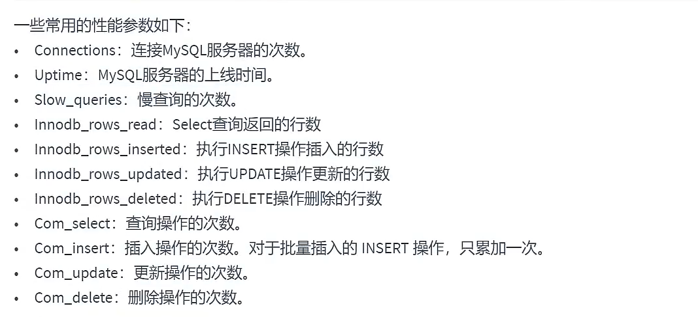


- 查询MySql服务器的连接次数

```mysql
SHOW STATUS LIKE "Connections";
```

- 查询服务器工作时间

```mysql
SHOW STATUS LIKE "Uptime";
```

- 查看Mysql服务器的慢查询次数

```mysql
SHOW STATUS LIKE 'slow_queries';
```

​	慢查询次数参数可以结合慢查询日志找出慢查询语句，然后针对慢查询语句进行`表结构优化`或者`查询语句优化`


### 3、统计sql的查询成本：last_query_cost

一条sql查询语句在执行前需要确定查询执行计划，如果存在多种执行计划的话，mysql会计算每个执行计划所需要的成本，从中选择成本最小的一个作为最终执行的执行计划。

如果我们想要查看某条sql语句的查询成本。可以在执行完这条sql语句之后，通过查看当前会话中的`last_query_cost`变量值来得到当前查询的成本，它通常也是我们`评价一个查询的执行效率的一个常用指标`，这个查询成本对应的是`sql；语句所需要读取的页的数量`.

通过查询语句结果集数据量的多少来对比，页得数量如果相差20倍，当时查询的效率并没有很明显的变化，实际上sql查询的时间基本上一样了，就是因为采用了顺序读取的方式将页一次性加载到缓冲池中，然后再进行查询，虽然`页数量(last_query_cost)增加了不少`，但是通过缓冲池的机制，`并没有增加多少查询时间`。

使用场景： 它对于比较开销是非常有用的，特别是我们有好几种查询方式可选的时候。

> sql查询是一个动态的过程，从页加载的角度来看，我们可以得到以下两点结论：
>
> 1. `位置决定效率`.如果页就在数据库缓冲池中，那么效率是最高的，否则还需要从内存或者磁盘中进行读取，当然针对单个页的读取来说，如果页存在于内存中，会比在磁盘中读取效率高很多。
> 2. `批量决定效率`。如果我们从磁盘中对单一页进行随机读，那么效率是很低的，而采用顺序读取的方式，批量对页进行读取，平均一页的读取效率就会提升很多，甚至要快于单个页面在内存种的随机读取.
>
> 所以说,遇到 I/O 并不用担心，方法找对了，效率还是很高的。我们首先要考虑数据存放的位置，如果是经常使用的数据就要尽量放到缓冲池里，其次我们可以充分利用磁盘的吞吐能力，一次性批量读取数据，这样单个页的读取效率也得到提升。


### 4、定位执行慢的SQL:慢查询日志


Mysql的慢查询日志，用来记录在Mysql中`响应时间超过阈值`的语句,具体只运行时间超过`long_query_time`值得sql，则会被记录到慢查询日志中。long_query_time的默认值是10，意思是运行10秒以上的语句，认为是超过了我们的最大忍耐的是兼职。

它的主要作用是，帮助我们发现那些执行时间特别长的sql查询，并且有针对性的进行优化，从而提升系统的整体效率。当我们的数据库服务器发生阻塞、运行变慢的时候，检查一下慢查询日志。

默认情况下，Mysql数据库`没有开启慢查询日志`，需要我们手动来设置这个参数，`如果不是调优需要的话，一般不建议启动该参数`，因为开启慢查询日志会或多或少的带来一定的性能影响。

慢查询日志将日志记录写入文件。

#### 4.1 开启慢查询日志参数

开启slow_query_log

在使用前，我们需要先看下慢查询是否开启，使用以下命令：

```mysql
#查看慢查询日志  是否开启  off 关闭
show variables like "%slow_query_log%";

#slow_query_log 表示慢日志开关
#slow_query_log_file 表示慢查询日志位置
```


打开慢查询日志

```mysql
#打开日志开关
set global  slow_query_log = on;
```


修改long_query_time阈值

```mysql
#查看慢查询时间阈值
show variables like "%long_query_time%";

#修改成3秒  如果设置成global则仅对新连接的客户端有效。 所以需要同时修改global和session级别的会话值
set long_query_time = 3
```


补充说明 如果想重启服务后依旧生效则修改其配置文件

修改my.cnf文件，在[mysqld]下增加或修改参数 long_query_time、slow_query_log和slow_query_log_file后，重启mysql

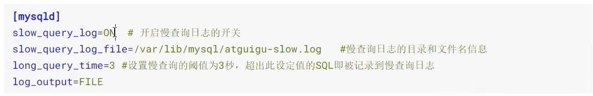


如果不指定存储路径，慢查询日志将默认存储到Mysql数据库的数据文件夹下，如果不指定文件名，默认文件名为hostnama-slow.log


#### 4.2 查看慢查询数目

```mysql
SHOW GLOBAL STATUS LIKE "%slow_queries%";
SHOW STATUS LIKE "%slow_queries%";
```

#### 4.3 案例

准备一张大表

#### 4.4 测试分析 

执行一些慢sql 并进行分析

```mysql
show status like 'slow_queries';
```

补充： min_examined_row_limit.

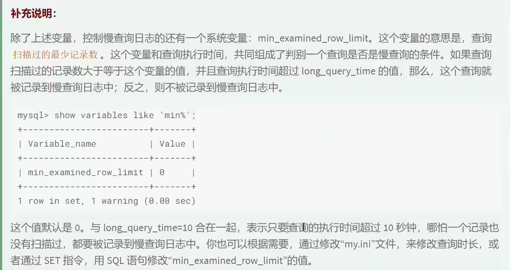


#### 4.5 慢查询日志 分析工具：mysqldumpslow

在生产环境中，如果要手工分析日志，查找、分析sql，显然是个体力活，Mysql提供了日志分析工具mysqldumpslow。

查看mysqldumpslow帮助信息

```shell
#mysqldumpslow 是mysql工具 在根目录执行
mysqldumpslow --help
```


**常用的查询：**

```shell
mysqldumpslow -s c -t 10 /var/run/mysqld/mysqld-slow.log # 取出使用最多的10条慢查询

mysqldumpslow -s t -t 3 /var/run/mysqld/mysqld-slow.log # 取出查询时间最慢的3条慢查询

mysqldumpslow -s t -t 10 -g “left join” /database/mysql/slow-log # 得到按照时间排序的前10条里面含有左连接的查询语句

mysqldumpslow -s r -t 10 -g 'left join' /var/run/mysqld/mysqld-slow.log # 按照扫描行数最多的

mysqldumpslow -a -s t -t 10 -g 'left join' /var/run/mysqld/mysqld-slow.log # 按照时间排序原始查询的sql语句
```


#### 4.6关闭慢查询日志

MySql服务器停止慢查询日志功能有两种方式：

一、永久性方式

​	修改my.cnf或者my.ini文件，把[mysqld]组下的slow_query_log设置成off,修改保存后，重启服务器，即可生效；

二、临时性方式

​	使用set语句来设置。 set global slow_query_log=off;


#### 4.7 删除慢查询日志

show variables like "%slow_query_log%";

​	当使用完慢查询日志之后，在目录下直接删除慢查询日志即可


### 5、查看SQL执行成本：show profile

Show Profile是Mysql提供的可以用来分析当前会话中sql都做了什么、执行的资源消耗情况的工具，可用于sql调优的测量。默认情况下关闭状态，并保存最近15次的运行结果。

我们可以在会话级别开启这个功能

```mysql
show variables like 'profiling';
```

通过设置profiling=on 来开启show profile：

```mysql
set profiling= "ON";
```

接着看下当前会话有那些profiles,使用下面这条命令

```mysql
show profiles;
```

如果想要看最近一次查询的开销：

```mysql
show profile;
```

查看具体情况则是

```mysql
show profile cpu,block io for query 2;
```


### 6、分析sql查询语句 EXPLAIN

#### 6.1 概述

**定位了慢查询sql之后，我们就可以使用explain或者describe工具做针对性的分析查询语句**，DESCRIBE语句的使用方式和EXPLAIN是一样的，分析结果也是一样的。

mysql中有专门负责优化select语句的优化器模块，主要功能：通过计算分析系统中收集到的统计信息，为客户端请求的Query提供它认为最优的执行计划(它认为的最优的检索方式，但不见得是DBA认为的最优的，这部分最耗费时间)。

这个执行计划展示了接下来具体执行查询的方式，比如多表连接的顺序是什么，对于每个表草用什么访问方法来具体执行查询等。Mysql为我们提供了explain语句来帮助我们查看某个查询语句的具体执行计划。explain的各个输出项，可以有针对的提升我们查询语句的性能。

能做什么？

- 表的读取顺序
- 数据读取操作的操作类型
- 那些索引可以使用
- 那些索引被实际使用
- 表之间的引用
- 每张表有多少行被优化器查询


#### 6.2 基本语法

EXPLAIN或DESCRIBE语法形式如下：

```mysql
[EXPLAIN|DESCRIBE] select * from tableName;
```


输出的信息就是所谓的执行计划。在这个执行计划的辅助下，我们需要知道应该怎么样去改进自己的查询语句使其执行更高效。


**EXPLAIN语句输出的各个列作用如下:**

| 列名          | 描述                                                   |
| ------------- | ------------------------------------------------------ |
| id            | 在一个大的查询语句中每个select关键字都对应一个`唯一id` |
| select_type   | select关键字对应哪个查询的类型                         |
| table         | 表名                                                   |
| partitions    | 匹配的分区信息                                         |
| type          | 针对单表的访问方式                                     |
| possible_keys | 可能用到的索引                                         |
| key           | 实际用到的索引                                         |
| key_len       | 实际使用索引的长度                                     |
| ref           | 当使用索引列等值查询时，与索引列进行等值匹配的对象信息 |
| rows          | 预估的需要读取的记录条数                               |
| filtered      | 某个表经过搜索条件过滤后剩余记录条数的百分比           |
| extra         | 额外信息                                               |


#### 6.3 数据准备


#### 6.4 EXPLAIN各列作用


 


