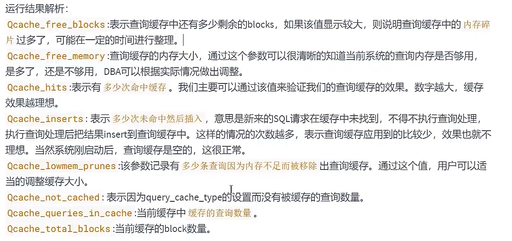

# Mysql基础


```mysql
 DELIMITER &      #修改结束符号为 &
```

### 创建临时表

```mysql
CREATE TEMPORARY  TABLE a_table
select sum(`view_num`) as sum_view from my_test_c;
```

## 查询视图


## 存储过程

```mysql
# INOUT   入参出参
# OUT  只出参
# IN 只传入
CREATE PROCEDURE name(INOUT param type)
BEGIN

END ;

#调用存储过程
CALL name()

#------ 举例  ------ 
  DELIMITER //
  CREATE PROCEDURE test_pro()
  BEGIN

    SET @NUM = 0;
    loop_a:LOOP
      SET @NUM = @NUM+1;
      IF @NUM > 10 THEN LEAVE loop_a; END IF;
      END LOOP loop_a;

    select @NUM;
  END //
  DELIMITER ;
```

## 存储函数

```mysql
CREATE FUNCTION 函数名(参数名  类型)
RETURNS 返回值类型
#  LANGUAGE SQL|NOT DETERMINISTIC|SQL SECURITY DEFINER|COMMENT '...'  {函数特性}  

BEGIN
	函数体 #return
END

#调用存储函数
SELECT 函数名()
```

### 存储函数特性

~~~mysql
{存储函数特性的说明}
1. LANGUAGE SQL:
这个子句是没有功能作用的,仅仅是说明下面过程体中所使用的是SQL语言编写.这也是系统默认的.默认不代表完全可省略,因为某些DBMS需要它,如果要考虑IBM的DB2的兼容性可以写上,此外,今后可能会出现SQL外的其他语言支持的存储过程.

2. NOT DETERMINISTIC:
传递给系统的信息,即不确定的.如果一个存储过程每次调用只要参数一样,输出也一样,即为确定的.本例中的主体语句为SELECT语句,则返回值肯定是未知的,因此,此处为 NOT DETERMINISTIC.MySQL内置的优化程序不会注意这些,至少现在不注意.

3. SQL SECURITY DEFINER:
指定权限控制,指定在调用时如何认定调用方的权限:DEFINER表示不管调用方是谁,都拥有定义者的权限,INVOKER表示仅按调用方本身的权限调用.

4. COMMENT '...':

存储过程的注释说明文本.默认值为空('').
~~~


### 存储过程和函数的查看与修改

```mysql
#1、查看
SHOW CREATE PROCEDURE  存储过程名字;
SHOW CREATE FUNCTION   存储函数名字;


#2、查看状态信息
SHOW PROCEDURE STATUS; # LIKE  "名称" 可以模糊查询

#3、也可以从 information_schema.Routines 查看
SELECT * FROM information_schema.Routines WHERE  ROUTINE_NAME = '名字';


#修改存储过程或者函数。 不能修改其功能   只是修改相关的特性
ALTER PROCEDURE 名字 
SQL SECURITY INVOKER
COMMENT '修改后的描述';


#删除存储过程或者函数
DROP FUNCTION IF EXISTS 存储函数名字;
DROP PROCEDURE IF EXISTS  存储过程名字;
```


## mysql系统变量

### 系统变量

```mysql
# 两个 @@ 来标示系统变量    一个@是用户自定义变量

###########     查看系统变量
SHOW GLOBAL VARIABLES;
#SHOW GLOBAL VARIABLES LIKE 'admin_%';

#SHOW GLOBAL VARIABLES LIKE 'admin_%';

查看会话变量
SHOW SESSION VARIABLES;

SHOW VARIABLES; #默认查询会话变量


#查看系统指定一个系统变量  用两个 @@ 来标示系统变量    一个@是用户自定义变量
SELECT @@global.max_connections;
#查看 指定的一个会话变量
SELECT @@session.变量名;
 #先查询会话系统变量。再次查询全局系统变量
SELECT @@max_connections;


###########      修改全局系统变量

两种修改方式
SET @@global.max_connections = 161;
SET GLOBAL  max_connections = 171;


修改以上变量后 针对当前数据库实例有效。重启后失效


###########      修改会话系统变量

SET @@session.character_set_client = "gbk";
SET SESSION character_set_client = "utf8mb4";

修改以上变量后 针对当前数据库连接有效。


```

### 用户变量

```mysql
###########      用户会话变量
# 赋值 = 或者 :=
方式1:
SET @用户变量 = 变量值;
使用
SELECT @变量名;

方式2:
SELECT @count := COUNT(*) FROM tableName;
SELECT @count;
#其他用法
SELECT count(*) into @c FROM tableName;
SELECT @c;

以上变量当前连接有效


###########      用户局部变量
### {必须在存储过程或者存储函数中}
#定义
DECLARE 变量名 类型  DEFAULT 0 #如果没有DEFAULT。则默认为null
#赋值
SET 变量名 = 值;
SET 变量名 := 值;
#使用
SELECT 变量名


```

## 错误处理

**存储过程或者存储函数中使用**

### 错误名称定义（自定义错误码）

```mysql
#语法格式
DECLARE 错误名称 CONDITION FOR 错误码(或错误条件)

#定义  相当于为该错误码1048。自定义名称
 方式1: 
DECLARE error_field CONDITION FOR 1048;
 方式2:
DECLARE error_field CONDITION FOR SQLSTATE '42000';


```

### 定义错误捕捉程序

``` mysql
#语法 
DECLARE 处理方式 HANDLER FOR 错误类型 处理语句

#处理方式。 有三个值 CONTINUE EXIT UNDO
	 CONTINUE：表示遇到错误不处理。继续执行
   EXIT  	 ：遇到错误退出
   UNDO    ：遇到错误撤回之前的操作 mysql 暂时不支持
#错误类型
		SQLSTATE  '错误码' :表示长度为5的sqlstate_value类型的错误代码
		MYSQL_error_code : 匹配数值类型的错误代码
		错误名称 ： 表示自定义的错误名称{DECLARE 错误名称 CONDITION FOR 错误码(或错误条件)}
		SQLWARNING : 匹配所有01开头的sqlstate 错误代码
		NOT FOUND： 匹配所有的02开头的sqlstate 错误代码
		SQLEXCEPTION： 匹配所有没有被SQLWARNING和NOT FOUND捕捉到的错误码

#处理语句
	如果出现以上条件之一。则执行指定的错误语句。可以是简单的SET 变量=值。也可以是使用 BEGIN ... END 编写的复合语句

```

## 流程控制

### 1、分支结构 

#### 	1.1、if else

```mysql
#语法 ：
IF 分支条件  THEN 分支执行结果
ELSEIF ...  THEN 分支执行结果
ELSE ...  THEN 分支执行结果
END IF
```

#### 	1.2、CASE

```mysql
#语法：
CASE var
	WHEN 1 THEN ...
	WHEN 2 THEN ...
	ELSE ...
END CASE
```


### 2、循环结构

- **LOOP  : 一般用于简单的死循环**
- **WHILE : 先判断后执行**
- **REPEAT: 先执行一次 在进行判断**
- 循环名称(自定义) ：循环中的自定义名称可以省略。但是如果添加了 循环控制语句（LEAVE 或者 ITERATE） 则必须添加循环名称

#### 	2.1、LOOP

```mysql
# 需要在存储过程中使用
#loop_label 
循环名称(自定义):LOOP
	循环体
END LOOP 循环名称(自定义)

#退出循环 LEAVE loop_label

#---- 举例-- ----

DELIMITER //
CREATE PROCEDURE test_pro()
BEGIN

	SET @NUM = 0;
  loop_label:LOOP
  	SET @NUM = @NUM+1;
  	IF @NUM > 10 THEN LEAVE loop_label; END IF;
  	END LOOP loop_label;
  
	select @NUM;
END //
DELIMITER ;
```


#### 	2.2 WHILE

```mysql
循环名称(自定义 可忽略):WHILE 循环条件 DO
	循环体
END WHILE 循环名称(自定义 可忽略)


-- 举例

  DELIMITER //
  CREATE PROCEDURE test_pro()
  BEGIN
    SET @NUM = 0;
    WHILE @num < 10 DO
      SET @num = @num + 1;
      END WHILE;
    select @NUM;
  END //
  DELIMITER ;
  
  CALL test_pro()
```


#### 	2.3 REPEAT（执行一次循环体后在判断）

​		关键字： UNTIL: 退出 REPEAT的循环

```mysql
# 语法
循环名称(自定义) REPEAT
	循环体
	UNTIL 结束循环的条件
	END REPEAT 循环名称(自定义)
	
#-------- 举例 --------
  DELIMITER //
  CREATE PROCEDURE test_pro()
  BEGIN
    SET @NUM = 0;

    REPEAT 
      SET @NUM = @NUM + 1;
      UNTIL  @NUM > 10
    END REPEAT;


    select @NUM;
  END //
  DELIMITER ;
```


### 3、LEAVE和ITERATE的使用

- LEAVE   : 结束当前流程 （不一定非在循环里使用。也可以结束存储过程体、IF等）
- ITERATE : 结束本次循环 继续下一次（只能在循环里使用）


#### 	3、1 LEAVE-结束当前流程

~~~ mysql
# 举例  存储过程
DELIMITER //
CREATE PROCEDURE test_pro()
begin_lable: BEGIN
	DECLARE num int(10)  DEFAULT 0;
	IF num = 0 THEN LEAVE begin_lable;  #退出整个存储过程
		ELSE select 1;
	END IF;
END //
DELIMITER ;

# 举例  循环
DELIMITER //
CREATE PROCEDURE test_pro()
BEGIN
	DECLARE num int(10)  DEFAULT 0;

	while_lable : WHILE TRUE DO 
		IF num =10 THEN
			LEAVE while_lable; #退出 自定义为while_lable的循环 
		END IF;
		SET num = num + 1;
	END WHILE while_lable;
	select num;
END //
DELIMITER ;
~~~


#### 	3、2 ITERATE-退出本次循环 

~~~mysql
# 举例  循环 ITERATE
DELIMITER //
CREATE PROCEDURE test_pro()
BEGIN
	DECLARE num int(10)  DEFAULT 0;
	DECLARE count int(10)  DEFAULT 0;
	while_lable : WHILE TRUE DO 
		SET count = count + 1;
		SET num = num + 1;
		if num = 4 THEN 
			ITERATE while_lable;
		ELSEIF num = 10 THEN
			LEAVE while_lable; 
		END IF;
	END WHILE while_lable;
	select count;
END //
DELIMITER ;
~~~

## 关于游标

**注意**：MySQL游标只能用于存储过程和函数。 

游标(cursor)，是一个存储在MySQL服务器上的数据库查询，游标不是一条 SELECT语句，而是被该语句检索出来的结果集；可以看做是指向查询结果集的指针；通过cursor，就可以一次一行的从结果集中把行拿出来处理。


优势： 在存储程序中使用 逐条读取结果集中的数据，效率高 程序简洁

劣势： 性能问题 使用游标的过程 会对数据加锁，并发大的时候会影响业务之间的效率，因为是内存中处理，还会消耗系统资源，造成内存不足。


### 	1、游标的处理过程

 - **1、游标声明**  没有检索数据，只是定义要使用的select语句

 - ```mysql
   DECLARE cursor_name CURSOR FOR select_statement
   #声明一个游标cursor_name，让其指向查询select_statement的结果集。
   
   #注意： 游标声明必须出现在变量和条件声明的后面，但是在异常处理声明的前面
   #　   一个过程中可以有多个游标声明
   ```

   

- **2、打开游标** 打开游标以供使用，用上一步定义的select语句把数据实际检索出来

- ~~~mysql
  OPEN cursor_name;
  #cursor_name是声明中定义的名字；打开游标时才执行相应的select_statement。
  ~~~

  

- **3、检索使用游标**  对于填有数据的游标，根据需要取出(检索)各行

  ~~~mysql 
  FETCH cursor_name INTO var_name [, var_name] ...
  #这条语句是指使用cursor_name这个游标来读取当前行，将数据保存到var_name这个变量中，游标指针知道下一行，如果游标读取数据行有多个列，则在into 关键字后赋值给多个变量名即可
  比如： FETCH cur_emp into emp1,emp1,emp1
  
  #一次只拿一行，拿完后，自动移动指针到下一行；
  #如果没有拿到行，会抛出异常，其SQLSTATE代码值为‘02000’，此时要检测到该情况，需要声明异常处理程序 (针对条件NOT FOUND也可以)，通常需要在一个循环中来执行fetch语句，通过检测以上异常来结束循环。
  ~~~

​		

- **4、关闭游标** 在结束游标使用时，必须关闭游标 收回游标占用的内存

- ```mysql
  CLOSE cursor_name;
  ```


### 2、游标的使用实例

```mysql
#游标使用实例
DELIMITER //
CREATE PROCEDURE test_pro(OUT out_id int,OUT out_num varchar(255))
BEGIN
	DECLARE num int(10)  DEFAULT 0;
	DECLARE count int(10)  DEFAULT 10;
	DECLARE l_id int(10)  DEFAULT 0;
	DECLARE l_title varchar(255)  DEFAULT '';
	DECLARE sum_cursor  CURSOR FOR SELECT id,title FROM nlsg_live limit count;
	OPEN sum_cursor;
	while_lable : WHILE TRUE DO 
		IF num = count THEN
			LEAVE while_lable;
		END IF;
		FETCH sum_cursor INTO l_id,l_title;
		#update nlsg_live set reason = 0 where `id` = l_id;
		SET num = num + 1;
	END WHILE while_lable;
	SET out_id = l_id;
	SET out_num = l_title;
	#SELECT id,title;
	CLOSE sum_cursor;
	END //
DELIMITER ;
```


## 触发器

#### 1、1 触发器定义 

​	触发器是由事件来触发某个操作， 事件包括 insert update delete事件，

**优势：**

1. 保证数据完整性。
2. 触发器可以帮助记录操作日志
3. 触发器可以用在操作数据前，对数据进行合法性检测

**劣势：**

1. 可读性差。由于触发器是由事件驱动，不受应用层控制。对系统维护不友好
2. 相关数据表结构的变更，有可能会导致触发器错误。


#### 1、2 触发器使用

- 创建触发器

  ```mysql
  # 触发器创建语法
  CREATE TRIGGER name
  {BEFORE|AFTER} {INSERT|UPDATE|DELETE} ON 表名
  FOR EACH ROW
  触发执行的语句块
  
   #错误程序 固定格式
  SIGNAL SQLSTATE "错误码" SET MESSAGE_TEXT = '错误信息'
  
  
  # 举例
  DELIMITER //
  CREATE TRIGGER trigger_insert_live
  AFTER INSERT ON nlsg_live
  FOR EACH ROW
  BEGIN
  	# 自定义错误流程判断
  	IF NEW.id > 10 
  		THEN SIGNAL SQLSTATE "HY001" SET MESSAGE_TEXT = 'error id > 10'; #自定义校验
  	END IF;
  	INSERT INTO nlsg_live_info(live_pid) VALUE(NEW.id);  #NEW 为当前insert 数据对象
  END //
  DELIMITER ;
  ```

  说明：

  	+ BEFORE|AFTER  表示事件触发时间。BEFORE在事件之前触发 AFTER在事件之后触发。
  	+ 表名 ：表示触发器监控对象。
  	+ {INSERT|UPDATE|DELETE} ： 表示触发事件。
   + 语句块 ： 可以是单条 也可以是由BEGIN...END 结构组合的复合语句。
     + 自定义错误程序：  SIGNAL SQLSTATE "错误码" SET MESSAGE_TEXT = '错误信息';
     + NEW : 关键字new为触发事件（insert|update）数据的对象。
     + OLD : 关键字 为delete事件数据的对象  OLD值因为是删除操作，所以全部是只读的。

- 查看触发器

  ```mysql
  #方式一  查看当前数据库触发器信息
  SHOW TRIGGERS;
  #方式二  查看当前数据库某个触发器信息
  SHOW CREATE TRIGGER trigger_name;
  #方式三   查看系统库所有的触发器信息
  select * from information_schema.TRIGGERS;
  ```

  

- 删除触发器

  ~~~mysql
   #方式一
  DROP TRIGGER trigger_name;
   #方式二。 检索后删除   推荐使用
  DROP TRIGGER IF EXISTS trigger_name;
  ~~~

  


## Mysql8.0 的新特性


### 1、窗口函数（部分）

​	类似于group by排列，但是不会对数据进行聚合，依旧保持原有数据行数，对数据列进行规则排序

​	

- 语法结构

```mysql
#语法格式
 mysql函数 OVER ([PARTITION BY 字段名 ORDER BY 字段名 ASC｜DESC]) 
```

- 序号类型函数

  -在结果集中多现实一列 作为分组之后排序的列

  

  **ROW_NUMBNER() 函数   **

  ```mysql
  # ROW_NUMBER() 函数  
  #  - 在结果集中多现实一列 作为分组之后排序的列   条件值相同时进行不重复排序
  select * from (
  SELECT ROW_NUMBER() OVER(PARTITION BY type ORDER BY collection_num DESC) as row_num 
  ,id,type,name,collection_num,view_num,real_view_num from my_test_c
  )  t where 
  row_num  <= 3
  
  ```

  

  **RANK() 函数 **

  ```mysql
  # RANK() 函数  
  # - 在结果集中多现实一列 作为分组之后排序的列  不同的是条件值相同时 进行重复值排序
  SELECT RANK() OVER(PARTITION BY type ORDER BY collection_num DESC) as row_num 
  ,id,type,name,collection_num,view_num,real_view_num from my_test_c
  
  ```

  

​	**DENSE_RANK() 函数**

```mysql
# RANK() 函数  
# - 在结果集中多现实一列 作为分组之后排序的列  不同的是条件值相同时 进行重复排序，下一个会继续排序
select * from (
SELECT DENSE_RANK() OVER(PARTITION BY type ORDER BY collection_num DESC) as row_num 
,id,type,name,collection_num,view_num,real_view_num from my_test_c
)  t where 
row_num  <= 3
```


# 高级mysql

## Mysql目录结构以及表文件系统


## MySql用户与权限控制


##### -- 刷新权限命令

```mysql
#	-- 刷新mysql权限命令
flush privileges;
```

### 用户管理

###### 	1、查看用户

```mysql
#查看用户
USE mysql;
SELECT host,user FROM user;
```

###### 	2、创建用户. 

`@‘%’`  为host连接，建议进行各种指令操作时带此参数

```mysql
#创建用户
CREATE USER 'name' identified by 'password';  #创建用户   默认host是%
CREATE USER `name`@`localhost` identified by '000000'   #创建本地host连接
```


###### 	3、修改用户

```mysql
# 3.1、修改用户
UPDATE user SET user ='test2' WHERE user ='test1' AND host = '%'

```

###### 	4、删除用户

```mysql
# 4、删除用户
DROP user 'test2';  #建议使用
DELETE FROM user WHERE user = 'test2' AND host = '%'; #此方式可能会有残留权限数据 删除不干净
```

###### 	5、修改密码

```mysql
#	3.2 修改当前链接用户的密码 
alter  user user() identified by 'new_password'; #写法一
SET PASSWORD= 'new_password';#写法二

#	3.3 修改其他用户的密码  root登陆后 
alter user 'test1'@'%' identified by 'new_password'; #写法一
SET PASSWORD FOR 'test1'@'%' = '000000'; #写法二
```

###### 	6、密码过期策略

```mysql
#设置 test1 用户的密码立刻过期
alter user 'test1'@'%' password expire 

#设置密码90天过期
create user "new_user"@"localhost" PASSWORD EXPIRE INTERVAL 90 DAY;  #新建用户
alter user "new_user"@"localhost" PASSWORD EXPIRE INTERVAL 90 DAY;  #修改用户

#设置密码永不过期
create user "new_user"@"%" PASSWORD EXPIRE NEVER;  #新建用户
alter user "new_user"@"%" PASSWORD EXPIRE NEVER;  #修改用户
```

### 权限管理

#### 	1、查看权限

```mysql
#查看root
SHOW GRANTS 
# 或者
SHOW GRANTS FOR CURRENT_USER;

## 查看某个用户的全局权限

SHOW GRANTS FOR 'user'@'%'
```

#### 	2、赋予权限

```mysql
 *.*(库名.表名)
 
# 赋予用户 所有权限   
grant ALL PRIVILEGES ON *.* TO 'new_user'@'%';


# 赋予用户 对 test库的查询和修改权限 
grant select,update  on test.* to 'new_user'@'%';
# 叠加赋予用户
grant delete  on test.* to 'new_user'@'%';
```

#### 3、回收权限

```mysql
#回收某个权限
REVOKE UPDATE,DELETE,INSERT ON *.* FROM `username`@`%`;   # *.*(库名.表名)

#回收所有的权限
REVOKE ALl PRIVILEGES ON *.* FROM `username`@`%`;

```

### 权限表

当mysql建立连接后将数据库用户权限信息写到内存中进行校验

在库名为mysql中以下表：

- user表   用户信息
- db表     操作库权限
- tables_priv  操作表权限
- columns_priv  操作列权限
- procs_priv   操作函数权限


当用户发出操作请求时

1. Mysql检查user表中的权限信息 匹配user、host字段值，查看全局权限是否允许，如果找到匹配信息。则执行操作，否则继续向下查找权限
2. 检查db表中的权限信息 匹配user、host值，查看请求的数据库级别的权限是否允许，如果找到匹配结果，则执行操作，否则继续向下查找权限
3. 检查tables_priv表中的权限信息，匹配user、host值，查看请求的数据表级别是否允许，如果找到匹配结果，则执行操作，否则继续向下查找权限
4. 检查columns_priv列中的权限信息，匹配user、host值，查看请求的数据列级别是否允许，如果找到匹配结果，则执行操作，否则mysql返回错误信息


### 角色管理

#### 	1、创建角色 

```mysql
CREATE ROLE 'name'@'%';  #一创建用户1
CREATE ROLE 'name1', 'name2' ... ;#二 创建用户

```

#### 	2、给角色赋予权限

```mysql
#赋予全部权限
GRANT ALL PRIVILEGES ON 库名.表明 TO '角色名';  

#赋予查询删除权限
GRANT SELECT,DELETE ON 库名.表明 TO '角色名';
```

#### 	3、查看角色权限

```mysql
SHOW GRANTS;   #root的权限
SHOW GRANTS FOR "角色名";   #角色名权限
```

#### 	4、回收角色权限

```mysql
REVOKE UPDATE ON 库名.表名 FROM "角色名";

#回收所有
REVOKE ALl PRIVILEGES ON *.* FROM "角色名";
```

#### 	5、删除角色

```mysql
DROP ROLE `角色名`
```

#### 	6、激活角色

```mysql
	mysql 创建了角色默认都是未激活状态
	
#查看当前用户激活状态的角色
SELECT CURRENT_ROLE();

#激活角色		#需要重新登陆后才能查看
set default role `角色名`@`%` TO `用户名`@`%`;

```

#### 	7、给用户赋予角色

```mysql
GRANT  `角色名`@`%` TO `用户名`@`%`;
```

	#### 	8、回收用户的角色

```mysql
REVOKE `角色` FROM `用户`@`%`
```


## mysql 逻辑架构


### 1、逻辑剖析


**sql 执行流程为：**sql语句 -> 查询缓存 -> 解析器 -> 优化器 -> 执行器。

	#### 	1.1 服务器处理客户端请求 

​	==客户端程序 connectors== >> ==连接池== >>  ==SQL接口== >>  ==解析器== >> ==优化器== >> ==查询缓存== >> ==插件式存储引擎== >> ==File（文件系统/日志文件）==


 	1. 客户端程序 : 包括一些mysql工具如：native 或者语言工具如：php 、go 、python
	1. 连接池  : 提供多个用户客户端和服务端交互的线程
	1. SQL接口 : 接收sql命令，返回查询结果
	1. 解析器  : 进行sql语法的解析、语意解析、生成语法树
	1. 优化器  : mysql核心组件，对sql命令进行优化
	1. 缓存    : 以key -> value方式缓存查询结果 (如果查询sql指令有缓存直接在SQL接口部分返回缓存结果)
	1. 存储引擎 : 与底层文件惊醒交互，查询数据文件系统、日志文件等


#### 1.2 Connertors

connectors 是指在不同语言中与sql的交互。 要使用mysql 可以编写程序与mysql服务端建立tcp连接 按照定义好的mysql协议进行交互。

接下来的mysql server结构分为如下三层。

#### 1.3 连接层

客户端访问mysql服务端前，需要建立tcp连接

经过三次握手连接成功后，mysql服务端对tcp传输的账号密码进行认证、权限获取（通过权限表获取权限写入内存）。

由于多个系统与mysql建立的连接并不止一个，所以为了结局tcp无限创建销毁TCP连接带来的资源消耗、性能下降问题。mysql服务器有专门的tcp连接池限制最大连接数，采用长连接模式复用tcp连接，来解决以上问题

#### 1.4 服务层

服务层主要完成大多数的核心服务功能，如SQL接口，缓存查询、SQL分析以及优化部分内置函数的执行，所有的跨存储引擎功能也在这一层实现，如：存储过程、存储函数。

在该层中，服务器会解析查询并创建相应的解析树、完成对其的优化如：确定表查询的顺序，是否利用索引等，最后生成相应的执行操作。

如果是查询SELECT语句 ，服务会查询内部缓存，如果缓存空间足够大，可以解决大量读操作的环境中很好的提升系统的性能。

- SQL Interface 接口

  -  接收sql命令，返回查询结果
  - 支持DML、DDl、存储过程、视图、触发器、自定义函数等多种SQL语言接口

- Parser：解析器

  - 进行sql语法的解析、语意解析、将sql分解成数据结构
  - sql指令传递到解析器的时候被解析器验证和解析，生成一个语法树，创建好之后还会对sql查询进行语法上的优化，进行查询重写。

- 查询优化器

  - sql命令在解析之后、查询之前会使用查询优化器确定sql语句的执行路径，生成一个执行计划

  - 这个执行计划表明应该使用哪些索引进行查询，表之间的顺序应该如何，最后按照执行计划中的步骤调用存储引擎提供的方法来真正的执行查询，并将结果返回

  - 他使用`选取-投影-连接`策略查询，如：

  - ```mysql
    select id,name from user where gender='女'
    ```

    这个sql查询先根据where进行`选取`，而不是将数据全部查询出来在进行过滤。

    这个sql先根据id和name进行属性`投影`，而不是将所有字段取出来在过滤

    将两个条件`连接`起来生成最后的结果

- 查询缓存组件（ mysql8.0 已经优化掉该过程 ）

  -  mysql内部维持着一些cache和buffer，比如query cache用来缓存一条select语句的结果。如果能在查询中找到对应的缓存，则不必在执行解析优化的过程直接返回缓存结果。
  - 缓存机制由一系列小缓存组成。如：表缓存、记录缓存、key缓存、权限缓存,并且可以在不同客户端之间共享
  - 从5.7。2之后不推荐使用查询缓存。`在mysql8.0中删除该机制`。

#### 1.5 引擎层

mysql的架构可以在不同场景中应用并发挥良好的作用，主要体现在存储引擎哈桑，插件式的引擎架构将查询处理和其他系统任务以及数据的存储提取分离。这种架构可以根据业务去求和实际需要选择合适的存储引擎，同时开源的mysql还允许开发人员设置自己的开发引擎。

插件式的存储引擎层，真正的负责了mysql中数据的存储和提取，对物理服务器级别维护的底层数据执行操作，服务器通过api与存储引擎通信。不同的存储引擎具有的功能不同，这样我们可以根据自己的实际需要进行选取。


#### 1.6 存储层

所有的数据、数据库、表的定义，表的数据、索引等都是存储在文件系统上以文件的形式存在，并且完雨存储引擎的交互，在文件系统下，可以使用本地磁盘，也可以使用DAS、NAS、SAN等各种存储系统。


### 2、SQL执行流程

#### 	2.1 mysql中的sql执行流程图


Mysql中的查询流程：

 1. `查询缓存`： Server如果在缓存中发现了sql语句，则直接返回 如果没有就进入解析器阶段。需要说明的是因为查询缓存往往效率不高，所以8.0就抛弃了这个功能。

    ​	一般建议在静态表里使用查询缓存，静态表就是极少更新的表，比如系统的配置表、字典表。好在mysql 提供了按需使用的方式，可以将my.cnf参数query_cache_type设置成DEMAND，代表sql语句中有sql_cache关键词时才缓存如：

    

    ```mysql
    #quert_cache_type 0表示关闭查询缓存OFF。1表示开启查询缓存ON.  2 表示 DEMAND
    query_cache_type=2 
    #对于你确定要使用查询缓存的语句时可以用SQL_CACHE显式指定：
    SELECT SQL_CACHE * FROM test where id = 1
    ```

    ​	在 5.7中查看是否开启查询缓存：

    ```mysql
    show variables like '%query_cache_type%'
    ```

    ​	监控查询缓存的命中率：

    ```mysql
    show status like '%Qcache%';
    ```

    

    

    

     

 2. 解析器：介于sql语句的语法分享、语义分析

​	


3. 优化器：  在优化器中会确定sql语句的执行路径，比如式根据全表检索 还是根据索引检索等

   ​	 在查询优化器中，分为逻辑查询优化和物理查询优化两个大块

   			- 物理查询优化是通过索引和表连接方式等技术进行优化
   			- 逻辑查询优化是通过sql等价变换提升查询效率，直白点说就是换一种执行效率高的写法。

   

   截止到现在，还没有真正的读表，而是产出了一个执行计划。于是进入到`执行器`阶段

4. 执行器： 

    	通过以上阶段所产生的执行计划进行操作。在执行之前需要判断用户是否具备权限。如果没有，返回权限错误，如果具备权限就会执行并返回结果。

    	执行器会根据表的引擎定义，调用存储引擎API对表进行读写。存储引擎Api只是抽象接口，下面还有一层存储引擎层，具体实现还要看表选择的存储引擎。

   

**总结**

至此sql语句在mysql中就执行完了。对于有索引的表，执行的逻辑也差不多。

 


#### 2.2 mysql中的sql执行原理

​	前面的机构很复杂，我们值需要抓去最核心的部分：sql执行原理。 不同的dbms的sql执行原理相同，在不同的软件中，各有各的实现路径

​	在不同的模块中，sql执行所使用的资源是怎么样的，如何对一条sql语句的执行时间进行分析：

 1. 确认`profiling`值

    ​	了解查询语句底层执行的过程：`SELECT @@profiling;` 或者 `SHOW variables like '%profiling%';`

    ​	查看是否开启了计划，开启这个值可以让mysql收集在sql语句执行时所使用的资源情况，命令如下：

    ```mysql
    SELECT @@profiling; 
    #或
    SHOW variables like '%profiling%';
    
    
    #profiling  0代表关闭 1代表开启
    set profiling = 1;
    
    
    
    #查看执行语句的资源情况
    SHOW PROFILES 
    # 或
    SHOW PROFILE FOR QUERY 157  #SHOW PROFILES 中的id值
    ```

    


### 3、存储引擎

​	存储引擎就是指表的类型，之前叫做`表处理器`，后来改名为`存储引擎`，存储引擎的功能就是接收上层传下来的指令，然后对表中的数据进行提取或写入操作

#### 	3.1、查看存储引擎

```mysql
#查看支持的存储引擎
SHOW ENGINES;
```

  


#### 3.2 设置系统默认的存储引擎

- 查看系统默认的存储引擎

  ```mysql
  #查看系统默认的存储引擎
  show variables like '%storage_engine%';
  #或
  SELECT @@default_storage_engine;
  ```

  

- 修改默认的存储引擎

    如果创建表的语句中没有显式指定表的存储引擎的话，那就会默认使用innodb作为表的引擎。如果我们想改变表的默认存储引擎的话，可以这样写启动服务器的命令：

  ```mysql
  SET DEFAULT_STORAGE_ENGINE=MyISAM;
  ```

  或修改my.cnf文件：

  ```mysql
  default-storage-engine=MyISAM
  #重启服务
  systemctl restart mysqld.service
  ```

  接着创建表不指定存储引擎，查看表结构。


#### 3.3 引擎介绍

 	1. `InnoDB引擎`：具备外键支持功能的事务存储引擎

- Mysql 从3.2 开始引入InnoDB引擎，从5.5之后默认都使用InnoDB

- InnoDB是Mysql的`默认事务型引擎`，它被设计用来处理大量的短期事务。可以确保事务的完整提交和回滚。

- 除了增加和查询外，还需要大量更新、删除操作，那么应该优先选择InnoDB存储引擎。

- 数据文件结构

  - 表名.frm 存储表结构（mysql8中合并到表名.ibd中）
  - 表名.ibd 存储数据和索引

- InnoDB 是为处理巨大数据量的最大性能设计。

- 对比MyISAM的存储引擎，`InnoDB写的效率差一些`,并且会占用更多磁盘空间以保存数据和索引。

- MyISAM只缓存索引，不缓存真实数据；InnoDB不仅缓存索引还要缓存还真是数据，`对内存要求较高`。而且内存大小对性能有决定性的影响。

  

2. `MyISAM引擎`： 主要的是非事务处理存储引擎

- MyISAM提供大量的特性，包括全文索引、压缩、空间函数等，但是MyISAM不支持事务、行级锁、外键，有个毫无疑问的缺陷就是，崩溃后无法安全恢复（事务性）
- .5.5之前默认的存储引擎
- 优势是`访问的速度快`，对事务完整性没有要求或者SELECT、INSERT为主的应用
- 针对数据统计有额外的一个`常数来存储`。故而count(*) 查询效率更高。
- 数据文件结构：
  - 表名.frm 存储表结构
  - 表名.MYD 存储数据（MYData）
  - 表名.MYI 存储表索引（MYIndex）
- 应用场景：只读应用或者以读为主的业务

3. `Archive引擎`，用于数据存档

- archive是归档的意思，仅仅支持`插入`和`查询`两种功能(行被插入后不能再次修改)
- 在Mysql5.5之后`支持索引功能`
- 拥有很好的压缩机制，支持zlib压缩裤，在记录请求的时候实时进行压缩，经常用做仓库来使用。
- 创建ARCHIVE表时，存储引擎会创建名称以表名开头的文件。底层数据文件的扩展名为.ARZ
- 同样数据量下，ARCHIVE表比MyISAM表要小大约75%，比支持事务处理的InnoDB表要小大约83%。
- ARCHIVE存储引擎采用了行级锁，该ARCHIVE引擎支持AUTO_INCREMENT列属性，AUTO_INCREMENT列可以具有唯一索引或非唯一索引。尝试在任何其他列上创建索引会导致错误。
- Archive表适合日志和数据采集档案类应用，适合存储大量的独立的作为历史记录的数据。拥有很高的插入速度，但是对查询的支持较差。


4. `Blackhole引擎`：丢弃写操作，读操作会返回空

- Blackhole引擎没有实现任何存储机制，它会`丢弃所有插入数据`，不做任何保存。
- 服务器会记录Blackhole表的日志，所以可以用于复制数据到备库，或者简单的记录到日志。但是这种应用方式会碰到很多问题，因此并不推荐


5. `CSV引擎`：存储数据时，以都好分割各个数据项

- CSV引擎可以将`普通的CSV文件作为Mysql的表来处理`,但是不支持索引

- CSV引擎可以作为一种`数据交换的机制`，非常有用

- CSV存储的数据直接可以在操作系统里，用文本编辑器，或者excel读取。

- 对于数据的快速导入、导出是有明显的优势。

- 创建CSV表时，服务器会创建一个纯文本的数据文件，其名称以表名开头并带有.CSV扩展名，当你将数据存储到表中时，存储引擎将其以逗号分隔值格式保存到数据文件中。

  

6. `Memory引擎`：置于内存的表

     Memory采用的逻辑介质是内存,响应速度快，但是当mysqld进程奔溃的时候数据会丢失，并且要求存储数据的是数据长度不变的格式，比如：Bolb和text类型的数据不可用的（长度不固定）

   主要特征：

- Memory引擎支持`哈希索引(HASH)`和`B+树索引`
  - 哈希索引相等的比较快，但是对于范围的比较慢很多。
  - `默认使用哈希索引`，其速度比使用B型树索引要快。
  - 如果希望使用B数索引，可以创阿金索引时选择使用。
- Memory表至少比myISAM表要`快一个数量级`
- MEmory表的`大小是受限制`的。表的大小主要取决于两个参数，分别是max_rows和max_heap_table_size.其中max_rows可以在创建表时制定；max_heap_table_size的大小默认为16mb，可以按需扩大
- 数据文件与索引文件`分开存储`
  - 每个机遇memory存储引擎的表实际对应一个磁盘文件，该文件的文件名与表名相同，类型为frm类型，该文件只存储表的结构，`数据文件都在内存中`
  - 这样有利于数据的快速处理，提供整个表的处理效率
  - 缺点就是数据容易丢失，生命周期短。
- 使用memory引擎的场景
  - `目标数据小，且频繁的访问`在内存中存放数据，如果太大的数据会造成内存溢出。可以通过max_heap_table_size参数控制其表的大小。
  - 如果数据是`临时`的，而且必须立即可用得到，那么就可以放在内存中
  - 存储在memory表中的数据如果`突然间丢失的话也没有太大的关系`。


7. `Federated引擎`：访问远程表

- federated引擎是访问其他mysql服务器的一个代理，尽管该引擎看起来提供了一种很好的跨服务器的灵活性，但也经常带来问题，因此是默认禁止的

7. `Merge引擎`：管理多个MyISAM表构成的表集合
8. `NDB引擎`：MySQL集群专用存储引擎


